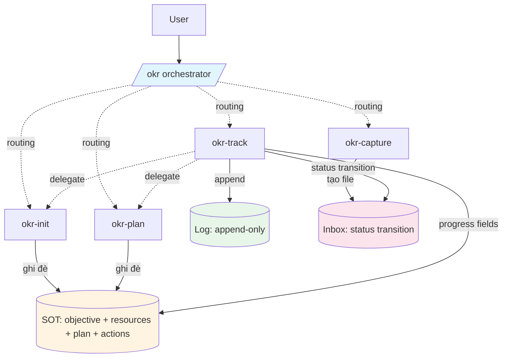
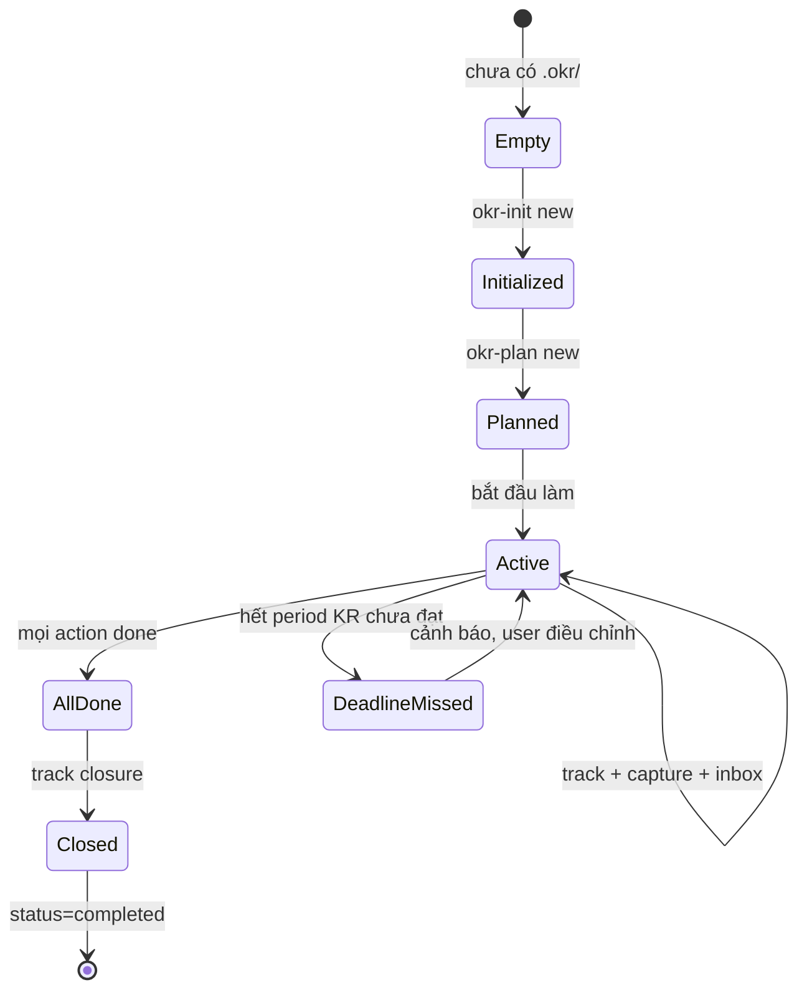
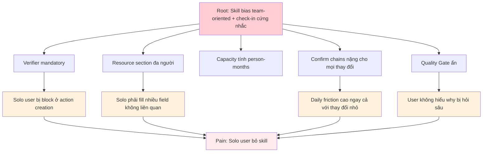
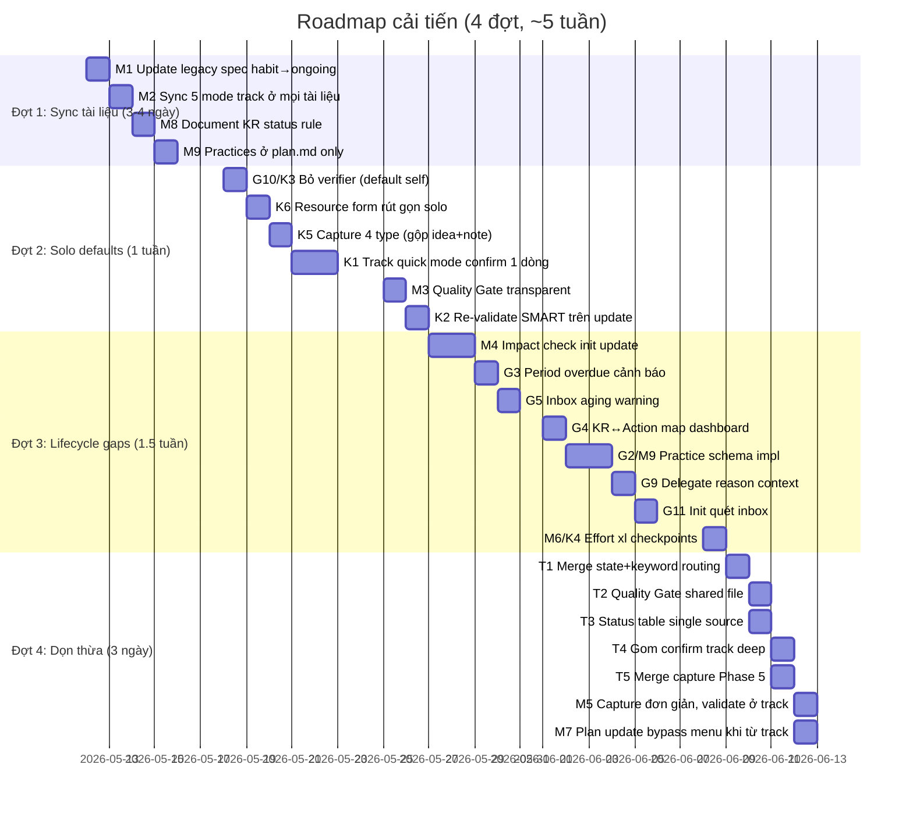

# Deep Insight: Review bộ skill OKR — BẢN CHỐT

> Ngày: 2026-05-10
> Phạm vi: Toàn bộ `skills/okr*/` + design specs + review trước
> Trạng thái: Đã chốt context và phạm vi cải tiến với user

---

## TL;DR

Bộ skill kiến trúc tốt (single entry, tách SOT/Log/Inbox, delegate clean), sau khi loại trừ phạm vi không cần thiết, còn:

| Loại | Phát hiện | Chốt làm | Bỏ / Modify |
|------|-----------|----------|-------------|
| Mâu thuẫn | 9 | 9 (2 modify) | 0 |
| Gap | 12 | 7 (2 modify) | 5 |
| Thừa | 5 | 5 | 0 |
| Không phù hợp | 6 | 6 | 0 |
| **Tổng** | **32** | **27** | **5** |

**Lõi (cập nhật)**: Skill có nhiều bias team-oriented và check-in cứng nhắc, không khớp với user solo, mục tiêu mơ hồ, check-in tự nhiên không cố định.

---

## Context đã chốt

| Tiêu chí | Quyết định |
|----------|------------|
| Persona | **Chỉ cá nhân**, không hỗ trợ team |
| Số objective | **Chỉ 1** mục tiêu / `.okr/` (không multi-objective workspace) |
| Frequency check-in | **Tự nhiên**, không bắt buộc daily/weekly/monthly |
| Tradeoff rigor vs ease | Ưu tiên ease: bỏ verifier mandatory, Quality Gate transparent |

→ Loại bỏ tất cả thiết kế giả định team hoặc multi-objective. Tập trung "1 user, 1 objective, friction thấp".

---

## 1. Quan sát đa chiều

### 1.1. Kiến trúc tổng thể



### 1.2. Schema dữ liệu

| File | Owner ghi | Định dạng | Hành vi |
|------|-----------|-----------|---------|
| `objective.md` | okr-init (struct), okr-track (KR/KI current) | YAML + bảng KR/KI | Ghi đè |
| `resources.md` | okr-init | YAML + 5 sections | Ghi đè |
| `plan.md` | okr-plan (struct), okr-track (counters, milestones[].status) | YAML milestones[] + body Roadmap | Ghi đè |
| `actions/AXXX-*.md` | okr-plan (struct), okr-track (status), okr-init (PIC sync) | YAML + 4 sections | Ghi đè |
| `actions/archive/*.md` | okr-track (move only) | Giống actions/ | Read-only |
| `inbox/*.md` | okr-capture (tạo), okr-track (status) | YAML + 2 sections | Status transition |
| `log/YYYY-MM-DD.md` | okr-track | YAML + thay đổi list | Append |
| `log/reviews/YYYY-MM-DD.md` | okr-track deep/closure | YAML + tổng kết | Append |

### 1.3. Lifecycle hiện tại



Vùng grey trước đây (paused/resume, multi-objective) đã được user xác nhận **không xử lý**. Period overdue chỉ cần cảnh báo.

---

## 2. Các vấn đề chốt xử lý

### 2.1. Mâu thuẫn (9 chốt làm)

#### M1. Type `ongoing` vs `habit` (legacy artifact)

- **Hiện tượng**: Design spec [2026-05-09](docs/superpowers/specs/2026-05-09-objective-kit-design.md) dùng `type: habit` + `streak`. Skill thực dùng `type: ongoing` + `ngưỡng tối thiểu`.
- **Hành động**: Update spec hoặc đánh dấu deprecated section. Note "Đã đổi sang Ongoing với KI thresholds".

#### M2. Số mode track không nhất quán

- **Hiện tượng**: 5 vị trí ghi mode khác nhau (3 mode, 4 mode, 5 mode).
- **Hành động**: Đồng bộ thành **5 mode** ở mọi nơi: `light, deep, closure, inbox-only, trace`.
- **Files cần sửa**: `okr-track/SKILL.md` (description), `okr/SKILL.md` (Phân vai SOT, Bảng subcommand), `CLAUDE.md` (skill table).

#### M3. Quality Gate "ẩn" mâu thuẫn với "trust user"

- **Hiện tượng**: Quality Gate chạy ngầm, follow-up đột ngột.
- **Hành động**: Khi fail, hiển thị 1 dòng ngắn "Mình đào sâu thêm vì [lý do cụ thể]" trước khi follow-up.

#### M4. Asymmetric impact analysis

- **Hiện tượng**: `okr-plan update` có "Tác động" auto check, `okr-init update-objective` không có.
- **Hành động**: `okr-init update-objective` thêm bước Impact Check. Quét `plan.md` + `actions/*.md`, hiển thị bảng tác động trước Phase 4 confirm. Vd: đổi `end_date` → liệt kê actions có `due_date` sau end_date mới.

#### M5. Capture giữ thuần log, validate ở track (modified)

- **Hiện tượng**: Capture gợi ý `related_kr` / `related_action` nhưng không validate.
- **Hành động (đã chốt)**: 
  - **Capture giữ đơn giản**: chỉ tạo file ghi nội dung user cung cấp + agent gợi ý loại + related (best-effort, không bắt buộc đúng).
  - **Track xử lý inbox**: validate `related_kr/action` ID thực tế lúc xử lý. Nếu sai → đề xuất đúng hoặc set null.

#### M6. Effort `xl` cảnh báo nhưng không enforce

- **Hiện tượng**: Cảnh báo soft, user vẫn ghi xl được.
- **Hành động**: Khi user giữ `xl`, BẮT BUỘC body action có 2-3 checkpoints (`### Checkpoints` section). Format:
  ```
  ### Checkpoints
  - [ ] [Mốc 1] (vd: Phase 1 done by 2026-11-15)
  - [ ] [Mốc 2] (vd: Phase 2 done by 2026-11-22)
  - [ ] [Mốc 3] (vd: Phase 3 done by 2026-11-29)
  ```
  Track có thể đọc checkpoints để check tiến độ giữa kỳ.

#### M7. Inbox `action` delegate sang `okr-plan update` (modified)

- **Hiện tượng**: Plan menu update không có entry "tạo từ inbox".
- **Hành động (đã chốt)**: 
  - **Không thêm menu option mới**.
  - LLM nhận context delegate (kèm danh sách inbox items) → tự chọn flow phù hợp (gộp vào "Thêm action mới" với data đã có sẵn từ inbox).
  - Document trong `okr-plan/SKILL.md` mode update Phase 1: "Nếu nhận context từ track inbox, các items đã có title/description/related → bypass hỏi lại, vào thẳng Phase 4 confirm."

#### M8. KR Status `pending → in-progress` chưa rõ rule

- **Hiện tượng**: 4 status (pending/in-progress/achieved/missed), nhưng rule chuyển không document.
- **Hành động**: Document trong `okr-track/references/metrics.md`:
  - `pending`: `current = baseline` (chưa bắt đầu)
  - `in-progress`: `baseline < current < target`
  - `achieved`: `current ≥ target`
  - `missed`: `current < target` AND `now > end_date`
  - Track tự auto-compute mỗi lần update KR.current.

#### M9. Practices schema chưa có

- **Hiện tượng**: 2 file (objective.md + plan.md) cùng có section Practices. Schema không document.
- **Hành động**: 
  - Practices nằm DUY NHẤT ở `plan.md`.
  - Bỏ section `## Practices` khỏi `objective.md` (nếu có).
  - Schema mỗi practice (lưu trong `plan.md` body):
    ```markdown
    ## Practices

    ### P1: Tập thể dục
    - frequency: weekly
    - target_count: 3
    - current_streak: 2
    - description: Cardio + strength, mỗi buổi 45 phút
    - ki_link: KI1
    ```

---

### 2.2. Gap (7 chốt làm, 5 bỏ)

#### G2. Recurring action / Practice schema (chốt làm)

- **Bối cảnh**: Ongoing có "Tập gym 3 lần/tuần". Action vs practice không rõ.
- **Hành động**:
  - One-off task (mua đồ tập, đặt lịch khám) → action file bình thường.
  - Repeating task (tập gym hàng tuần) → practice trong `plan.md` (xem M9 schema).
  - Track Ongoing: hỏi user "Tuần này đạt practice nào?" → update `current_streak`.

#### G3. Period rollover — chỉ cảnh báo (modified)

- **Bối cảnh**: Project end_date qua mà KR chưa achieved.
- **Hành động (đã chốt)**: 
  - **Không** tạo mode mới hoặc state machine.
  - Track Phase 1 (đọc state) detect: `now > end_date` AND `objective.status = active`.
  - Dashboard hiển thị cảnh báo:
    ```
    ⚠️ Period đã qua [X] ngày. KR chưa achieved: [list].
    Đề xuất: chạy `/okr init update-objective` để extend end_date hoặc đổi status sang `completed/cancelled`.
    ```

#### G4. KR ↔ Action map ngược (chốt làm)

- **Bối cảnh**: Khi KR1 at-risk, không có view "actions thuộc KR1".
- **Hành động**: Mở rộng dashboard track. Mỗi KR row kèm sub-line list actions:
  ```
  KR1: ████░░ 40/100 (40%) > on-track
    Actions: 3 done | 2 doing | 1 blocked
    Active: A001 (doing, An), A003 (doing, Bình), A005 (blocked)
  ```

#### G5. Inbox aging (chốt làm)

- **Bối cảnh**: Inbox tích lũy items pending mãi.
- **Hành động**:
  - Frontmatter inbox tính `staleness_days` từ `captured_at`.
  - Track Phase 5: items stale > 30 ngày → cảnh báo "Inbox cũ: [list]. Còn relevant không? (giữ/bỏ)".
  - Không auto-discard, chỉ hỏi.

#### G9. Delegate context — truyền `reason` (chốt làm)

- **Bối cảnh**: Track deep delegate sang init/plan, mất lý do gốc.
- **Hành động**: Delegate payload format:
  ```yaml
  delegate_to: okr-init update-objective
  context:
    changes:
      - field: KR2.target
        from: 50
        to: 35
    reason: "Market shift Q4 (track deep 2026-12-01): tăng trưởng ngành chậm 30%"
    source_review: log/reviews/2026-12-01.md
  ```
  Skill nhận delegate phải hiển thị `reason` cùng diff trong phase confirm.

#### G10. Verifier — luôn self-verify (modified)

- **Bối cảnh**: Solo user, verifier mandatory blocking.
- **Hành động (đã chốt, vì chỉ phục vụ cá nhân)**: 
  - **Bỏ field `verifier` khỏi action frontmatter** hoặc default = `"self"`.
  - Action-guide cập nhật: "Verifier mặc định là user tự verify qua DoD checklist. Không hỏi field này khi tạo action."

#### G11. Init quét inbox lúc tạo (modified)

- **Bối cảnh**: User capture trước khi có objective. Inbox null `related_kr`.
- **Hành động (đã chốt)**: 
  - `okr-init` mode `new` Phase 0 (sau detect mode): đọc `.okr/inbox/*.md` (nếu có).
  - Dùng nội dung inbox làm CONTEXT cho việc đề xuất KR / actions ban đầu.
  - Sau khi init xong, quay lại inbox: gợi ý map `related_kr` cho từng item.

#### Bỏ (5 gap)

| Gap | Lý do bỏ |
|-----|----------|
| G1. Multi-objective workspace | Chỉ 1 mục tiêu / `.okr/`, không cần workspace |
| G6. Log retention cap | Giữ đọc full reviews lúc closure |
| G7. Forecast / extrapolation | Giữ at-risk/on-track hiện tại, không thêm forecast |
| G8. Cross-objective conflict | Không có nhiều objective để conflict |
| G12. Pause/Resume snapshot | Giữ flow status đơn giản như hiện tại |

---

### 2.3. Thừa (5 chốt dọn)

| # | Chỗ thừa | Vị trí | Hành động |
|---|----------|--------|-----------|
| T1 | Routing keyword overlap với State table | `okr/SKILL.md` Bước 3 | Merge thành 1 bảng 3 cột (State, Keyword, Route) |
| T2 | Quality Gate copy-paste | okr-init Phase 0 + okr-plan Phase 0 | Tạo file shared `skills/okr/references/quality-gate.md`, ref từ cả 2 |
| T3 | Status table "Phân vai SOT" lặp 5 chỗ | okr/SKILL.md, okr-track/data-format.md, okr-system-review.md, CLAUDE.md, okr-plan/SKILL.md | Single source: `CLAUDE.md`, các nơi khác link sang |
| T4 | Confirm trong track deep nặng | track deep Phase 4 + delegate confirm × N | Gom thành 1 confirm "all changes" trước delegate; skill nhận delegate skip phase confirm nếu nhận signal "pre-confirmed" |
| T5 | Capture Phase 5 chỉ 1 dòng | okr-capture | Merge vào Phase 4 (sau ghi file, kèm reminder nếu inbox ≥5) |

---

### 2.4. Không phù hợp với solo (6 chốt fix)

| # | Không phù hợp | Hành động |
|---|---------------|-----------|
| K1 | Daily check-in confirm bảng đầy đủ | Track `light` thêm logic: thay đổi 1-2 field → confirm 1 dòng (vd `KR1: 40→50, A003 done — y/n?`). Bảng đầy đủ chỉ khi ≥3 field. |
| K2 | Re-check SMART chỉ ở init `new` | `okr-init update-objective` Phase 4 (trước confirm) re-validate SMART cho KR thay đổi. Cảnh báo nếu fail. |
| K3 | Verifier bắt buộc | Bỏ field hoặc default `"self"` (xem G10). |
| K4 | Effort xl không cho data | Hiển thị warning kèm số liệu chung "task xl thường overrun. Yêu cầu thêm checkpoints" (xem M6). |
| K5 | Capture 5 type quá phức tạp | Gộp `idea` + `note` → `thought`. Còn 4 type: `action, blocker, resource, thought`. |
| K6 | Resource bias team | Section "Nhân sự" rút gọn cho solo: chỉ giữ tên + capacity hours/week + skills. Bỏ Zalo/FB/SĐT/người quản lý công cụ. |

---

### 2.5. Sơ đồ nhân quả (cập nhật theo context solo, 1 objective)



**Nhân (gốc)**: Skill mặc định "team có structure".
**Duyên (điều kiện)**: User là solo, mục tiêu mơ hồ, check-in tự nhiên.
**Quả gần**: Verifier blocking, confirm chains, resource form thừa.
**Quả xa**: User bỏ skill sau 2 tuần.

→ Fix: bóc tách giả định team khỏi default flow. Solo là default duy nhất.

---

## 3. Đúc kết: Lõi vấn đề

### 3.1. Lõi (đã cập nhật theo context)

> **Skill có nhiều bias team-oriented và check-in cứng nhắc, không khớp với user solo có mục tiêu mơ hồ và check-in tự nhiên. Một khi gỡ bias này, hơn 70% các vấn đề (verifier, capture types, resource form, daily friction) tự khắc giải quyết.**

Kiểm chứng "bỏ đi thử":

| Bỏ đi | Hệ thống có sụp? |
|-------|------------------|
| Bỏ Quality Gate | Vẫn chạy, chất lượng giảm nhẹ |
| Bỏ Phase Confirm | Vẫn chạy, nguy hiểm hơn |
| Bỏ phân biệt Project / Ongoing | **SỤP** (logic KR vs KI khác hẳn) |
| Bỏ giả định "team" → "solo only" | **THAY ĐỔI 30% schema/flow** (verifier, resource, capacity, confirm UX) |

→ Lõi nằm ở **assumption persona team**, không phải feature riêng lẻ.

### 3.2. Hai nguyên lý gốc (đã rút gọn)

**Nguyên lý 1: Solo-only**

User là 1 cá nhân duy nhất. Bỏ mọi field/flow cho team (verifier riêng, PIC nhiều người, người quản lý tool, liên lạc Zalo/FB).

*Ẩn dụ*: Như xe đạp cá nhân, không phải xe bus. Xe đạp không cần ghế phụ, hệ thống vé, lịch trình.

**Nguyên lý 2: Friction theo cycle frequency tự nhiên**

Check-in tự nhiên có 2 trạng thái:
- **Quick update** (thay đổi nhỏ, 1-2 field): friction tối thiểu, 1 confirm dòng
- **Deep review** (mỗi vài tuần, nhiều thay đổi): friction cao OK, full analysis

Hiện tại tất cả medium friction → quick quá nặng, deep quá nhẹ.

*Ẩn dụ*: Đánh răng (mỗi ngày, 2 phút, không checklist) vs khám sức khoẻ (vài tháng/lần, full panel).

### 3.3. Roadmap triển khai



### 3.4. Tiêu chí đo thành công

| Metric | Mục tiêu |
|--------|----------|
| Daily quick check-in turn count | Từ 5-7 turn xuống **2-3 turn** |
| Verifier blocker khi tạo action | Từ 100% xuống **0%** (đã bỏ field) |
| Field thừa trong resources.md cho solo | Bỏ 5+ field (Zalo/FB/SĐT/người quản lý/manager) |
| Mode track không nhất quán giữa tài liệu | Từ 5 phiên bản xuống **1 phiên bản** |
| Trùng lặp status table | Từ 5 nơi xuống **1 nơi** (CLAUDE.md) |

---

## 4. Checklist triển khai (27 items)

### Đợt 1: Sync tài liệu

- [ ] **M1**: Update `docs/superpowers/specs/2026-05-09-objective-kit-design.md` đổi `habit` → `ongoing`, bỏ streak/frequency, thêm `review_cycle` + KI thresholds.
- [ ] **M2**: Sync mode `light, deep, closure, inbox-only, trace` ở:
  - [ ] `okr-track/SKILL.md` description (frontmatter)
  - [ ] `okr/SKILL.md` Phân vai SOT
  - [ ] `okr/SKILL.md` bảng `/okr <subcommand>`
  - [ ] `CLAUDE.md` skill table
- [ ] **M8**: Thêm vào `okr-track/references/metrics.md` rule auto-compute KR.status (pending/in-progress/achieved/missed).
- [ ] **M9**: 
  - [ ] Bỏ section `## Practices` khỏi `okr-init/references/data-format.md` schema objective.md
  - [ ] Thêm schema Practice format vào `okr-plan/references/data-format.md` (frequency, target_count, current_streak, description, ki_link)

### Đợt 2: Solo defaults

- [ ] **G10/K3**: Bỏ field `verifier` khỏi action frontmatter (hoặc default `"self"`). Cập nhật `action-guide.md` bỏ phần "Verifier (ai verify output)".
- [ ] **K6**: Rút gọn schema `resources.md`:
  - [ ] Bỏ cột "Liên lạc (Zalo/FB/SĐT/Địa chỉ)"
  - [ ] Bỏ cột "Người quản lý" trong section Công cụ
  - [ ] Section Nhân sự đổi thành Solo profile: tên, capacity hours/week, skills
- [ ] **K5**: Capture 4 type. Đổi schema inbox: `type: action | blocker | resource | thought`. Migration cũ: `idea` + `note` → `thought`.
- [ ] **K1**: `okr-track` mode `light` thêm logic:
  - [ ] Đếm số field thay đổi
  - [ ] Nếu ≤2 field → confirm 1 dòng `[diff] — y/n/sửa?`
  - [ ] Nếu ≥3 field → confirm bảng đầy đủ như hiện tại
- [ ] **M3**: Quality Gate khi fail hiển thị 1 dòng "Mình đào sâu vì [lý do]" trước follow-up. Cập nhật trong `okr-init/SKILL.md` + `okr-plan/SKILL.md`.
- [ ] **K2**: `okr-init update-objective` Phase 4 re-validate SMART cho KR thay đổi. Hiển thị warning nếu fail.

### Đợt 3: Lifecycle gaps

- [ ] **M4**: `okr-init update-objective` thêm "Impact Check" trước Phase 4 confirm. Quét `plan.md` + `actions/*.md` cho field thay đổi.
- [ ] **G3**: `okr-track` Phase 2 dashboard detect `now > end_date AND status = active` → block cảnh báo period overdue.
- [ ] **G5**: 
  - [ ] Frontmatter inbox tính `staleness_days` từ `captured_at`
  - [ ] `okr-track` Phase 5 cảnh báo items stale > 30 ngày
- [ ] **G4**: Mở rộng dashboard track. Mỗi KR row kèm sub-line danh sách actions liên quan (count + IDs).
- [ ] **G2/M9**: Implement Practice schema trong `plan.md` body. `okr-track` Ongoing Phase 4a hỏi update từng practice (current_streak).
- [ ] **G9**: Delegate payload format có `reason` field. Cập nhật:
  - [ ] `okr-track/SKILL.md` bước 5 Phase 4b (delegate)
  - [ ] `okr-init/SKILL.md` Phase 4 confirm (hiển thị reason)
  - [ ] `okr-plan/SKILL.md` Phase 4 confirm (hiển thị reason)
- [ ] **G11**: `okr-init` mode `new` Phase 0 đọc `.okr/inbox/*.md` (nếu có) làm context. Sau init xong, gợi ý map `related_kr`.
- [ ] **M6/K4**: Khi action `effort: xl`, body BẮT BUỘC có `### Checkpoints` section ≥2 mục. Cập nhật `task-format.md` + `action-guide.md`.

### Đợt 4: Dọn thừa

- [ ] **T1**: `okr/SKILL.md` Bước 3 merge "State / Intent" + "Keyword routing" thành 1 bảng 3 cột.
- [ ] **T2**: Tạo `skills/okr/references/quality-gate.md` chung. `okr-init` + `okr-plan` ref sang.
- [ ] **T3**: Single source "Phân vai SOT" ở `CLAUDE.md`. Các file khác link sang `CLAUDE.md#phân-vai-sot` thay vì copy.
- [ ] **T4**: 
  - [ ] `okr-track` deep gom tất cả thay đổi vào 1 confirm "all changes" trước delegate
  - [ ] Skill nhận delegate (init/plan) detect signal `pre-confirmed` → skip phase confirm riêng
- [ ] **T5**: Merge capture Phase 5 vào Phase 4 (sau ghi file, kèm 1 dòng reminder nếu inbox ≥5).
- [ ] **M5**: 
  - [ ] `okr-capture/SKILL.md` xác định rõ: "Chỉ tạo file ghi nội dung. Validate `related_kr/action` là việc của track."
  - [ ] `okr-track` Phase 5 (inbox processing) thêm bước validate ID, đề xuất sửa nếu sai.
- [ ] **M7**: `okr-plan/SKILL.md` mode `update` Phase 1 thêm note: "Nếu nhận context từ track inbox (kèm danh sách items pre-processed), bypass menu, vào thẳng Phase 4 confirm với data đã có."

---

## 5. Mapping nhanh: vấn đề → file cần sửa

| File | Số changes |
|------|-----------|
| `skills/okr-track/SKILL.md` | M2, K1, G3, G4, G5, G9, M5, T4 (8) |
| `skills/okr-init/SKILL.md` | M3, M4, K2, G9, G11, T2 (6) |
| `skills/okr-plan/SKILL.md` | M3, M9, M7, G2, G9, T2 (6) |
| `skills/okr-capture/SKILL.md` | K5, T5, M5 (3) |
| `skills/okr/SKILL.md` | M2, T1, T3 (3) |
| `skills/okr-init/references/data-format.md` | M9, K6 (2) |
| `skills/okr-init/references/okr-guide.md` | M1 (1) |
| `skills/okr-plan/references/data-format.md` | M9, G2 (2) |
| `skills/okr-plan/references/task-format.md` | G10, M6 (2) |
| `skills/okr-plan/references/action-guide.md` | G10, M6/K4 (2) |
| `skills/okr-track/references/metrics.md` | M8, G3 (2) |
| `skills/okr-track/references/data-format.md` | M2, T3 (2) |
| `skills/okr-capture/references/data-format.md` | K5 (1) |
| `skills/okr/references/quality-gate.md` (mới) | T2 (1) |
| `CLAUDE.md` | M2, T3 (2) |
| `docs/superpowers/specs/2026-05-09-objective-kit-design.md` | M1 (1) |

→ Tổng ~16 file cần sửa, ~27 changes.

---

## Phụ lục: Items đã bỏ (5)

| Code | Phát hiện | Lý do bỏ |
|------|-----------|----------|
| G1 | Multi-objective workspace | Chỉ 1 objective / `.okr/`, làm tốt 1 trước |
| G6 | Log retention cap | Giữ đọc full reviews lúc closure |
| G7 | Forecast / extrapolation | Giữ at-risk/on-track hiện tại |
| G8 | Cross-objective conflict | Không có nhiều objective |
| G12 | Pause/Resume snapshot | Giữ flow status đơn giản |

Có thể revisit nếu phạm vi mở rộng (vd: hỗ trợ team, multi-objective).
