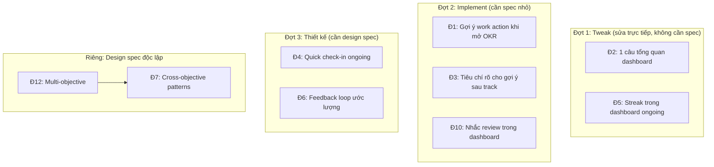

# Đề xuất cải tiến OKR: Từ công cụ ghi chép sang trợ lý đồng hành

> Ngày: 2026-05-12 | Cập nhật: 2026-05-13
> Phạm vi: Review 5 skill, giữ lại đề xuất có giá trị thực sau đối chiếu codebase.

## Bối cảnh

OKR hiện tại làm tốt việc ghi chép và quản lý dữ liệu mục tiêu. Nhưng có khoảng cách giữa "biết trạng thái" và "biết hành động": user mở OKR, thấy số liệu, nhưng phải tự diễn giải và tự chọn việc làm tiếp.

Đợt cải tiến này thu hẹp khoảng cách đó bằng cách nâng cấp phần hiển thị và gợi ý, KHÔNG thay đổi kiến trúc hay SOT.

### Scope thực tế sau review

Từ 12 đề xuất ban đầu, sau đối chiếu codebase còn:

| Loại                                               | Số lượng | Chi tiết    |
| -------------------------------------------------- | -------- | ----------- |
| Implement (gap thật, cần spec)                     | 3        | Đ1, Đ3, Đ10 |
| Tweak (1-2 dòng prompt)                            | 2        | Đ2, Đ5      |
| Thiết kế lại (vấn đề thật, giải pháp cũ chưa đúng) | 2        | Đ4, Đ6      |
| Tách design spec riêng                             | 2        | Đ7, Đ12     |
| Loại (duplicate hoặc không có gap)                 | 3        | Đ8, Đ9, Đ11 |


---

## Phần A: Implement (3 đề xuất)

### Đ1: Gợi ý work action khi mở OKR

**Đã có**: Orchestrator `SKILL.md:62-70` có "Gợi ý tiếp theo" nhưng gợi ý **system action** ("Chạy track light", "Chạy deep review"). Không gợi ý **work action** cụ thể.

**Gap**: User mở OKR muốn biết "hôm nay làm gì?", không phải "chạy command gì?". Với 15 action đang mở, user phải tự scan và chọn.

**Cách làm**: Mở rộng bảng gợi ý ở orchestrator. Thêm 1-2 dòng action cụ thể TRƯỚC gợi ý system action:

```
Ưu tiên hôm nay
  → A003: Xây MVP (deadline mai, chặn A004 + A005)
  → A007: Phân tích data (quá hạn 3 ngày)

Gợi ý: chạy track light để cập nhật tiến độ.
```

**Tiêu chí chọn action** (theo thứ tự ưu tiên):

1. Action quá hạn (overdue)
2. Action đang block action khác (dependency)
3. Action deadline trong 3 ngày tới
4. Action priority critical/high đang doing

**Thay đổi file**: `skills/okr/SKILL.md` section Bước 2.

---

### Đ3: Tiêu chí rõ cho gợi ý sau track

**Đã có**: `flow-light.md:53` ghi "Đề xuất next action: highlight việc cần làm trong 1-7 ngày tới". `okr-track` rules ghi "LUÔN đề xuất next action cụ thể (file/người/thời điểm)".

**Gap**: Instruction quá chung, không có tiêu chí chọn. LLM tự đoán, kết quả không ổn định.

**Cách làm**: Thay instruction chung bằng tiêu chí cụ thể trong `flow-light.md` step 7:

```
Đề xuất 3 việc tiếp theo (chọn theo thứ tự ưu tiên):
1. Action đang block action khác (ghi rõ: "A003 đang chặn A004, A005")
2. Action deadline gần nhất trong 7 ngày tới
3. Action priority cao nhất chưa bắt đầu
4. KR at-risk cần hành động (ghi rõ: "KR2 cần +8 đơn vị/tháng")

Mỗi gợi ý kèm 1 lý do ngắn (≤10 từ).
```

Áp dụng tương tự cho `flow-deep.md` Bước 8.

**Thay đổi file**: `skills/okr-track/references/flow-light.md`, `skills/okr-track/references/flow-deep.md`.

---

### Đ10: Nhắc review trong dashboard

**Đã có**: Dashboard hiển thị "Log gần: YYYY-MM-DD". Không có logic nhắc khi quá hạn review.

**Gap**: Review là bước quan trọng nhất (không review → không học → không cải thiện). Nhưng user chỉ track light qua loa, quên deep review. Không ai nhắc.

**Giới hạn**: OKR chạy on-demand. Nhắc chỉ hiển thị KHI user mở OKR. Không giải quyết được "user quên mở OKR". Nhưng giải quyết được "user track thường xuyên mà quên review".

**Cách làm**: Thêm logic vào Phase 2 dashboard (cả orchestrator lẫn okr-track):

```
Điều kiện nhắc (check tuần tự, first match):
1. Project: đã qua 50% period + chưa có log type=review → "Đã qua nửa period, chưa review lần nào."
2. Ongoing: today - last_review_date > review_cycle × 1.5 → "Quá hạn review N ngày."
3. Mọi type: today - last_log_date > 14 ngày → "Chưa track 2 tuần. Cân nhắc chạy track."

Hiển thị 1 dòng ngay sau block status, trước "Gợi ý tiếp theo".
```

**Thay đổi file**: `skills/okr/SKILL.md` section Bước 2, `skills/okr-track/SKILL.md` Phase 2.

---

## Phần B: Tweak (2 thay đổi nhỏ, không cần spec)

### Đ2: Thêm 1 câu tổng quan sức khoẻ vào dashboard

**Đã có**: Dashboard hiển thị trend per KR (on-track/at-risk) + "Cần chú ý".

**Thay đổi**: Thêm 1 instruction vào Phase 2 template: "Mở đầu dashboard bằng 1 câu tổng quan, ví dụ: 'Dự án on-track, KR2 cần chú ý.'"

**File**: `skills/okr-track/SKILL.md` Phase 2.

---

### Đ5: Hiển thị streak trong dashboard ongoing

**Đã có**: `current_streak` tồn tại trong `plan.md` practices. Streak reset warning đã có ở flow-light step 10.

**Thay đổi**: Thêm streak vào template ongoing dashboard:

```
Key Indicators
  KI1: Tập thể dục    ≥3 lần/tuần   current: 4   ✅ healthy   streak: 5 tuần
```

Thêm instruction: "Streak ≥ 4 tuần hiển thị kèm biểu tượng. Đạt mốc 7, 30, 100 tuần thì ghi nhận 1 dòng."

**File**: `skills/okr-track/SKILL.md` Phase 2 template ongoing.

---

## Phần C: Cần thiết kế lại (2 đề xuất)

### Đ4: Quick check-in cho ongoing (đề xuất cũ: "Điểm danh hàng ngày")

**Vấn đề thật khác với mô tả cũ**: Đề xuất cũ nói "Ongoing chỉ track theo chu kỳ review". Thực tế flow-light ongoing ĐÃ cho phép track bất kỳ lúc nào, ĐÃ hỏi practice y/n. Vấn đề thật: flow ongoing light quá nặng cho check-in hàng ngày (10 bước: hỏi KI, hỏi action, confirm, ghi log...). User chỉ muốn tick "hôm nay đã tập chưa?", không muốn chạy full flow.

**Hướng thiết kế mới**: Sub-mode "quick check-in" cho ongoing:

- Chỉ hiển thị practices → hỏi y/n per practice → update streak → xong
- Không hỏi KI current (KI update theo review_cycle)
- Không hỏi action status
- Không confirm (chỉ streak +1 hoặc reset, reversible)
- Ghi 1 dòng log minimal

**Cần thiết kế**: Trigger gì để vào quick check-in thay vì light? Schema log cho daily check-in? Quan hệ với review_cycle?

---

### Đ6: Feedback loop ước lượng (đề xuất cũ: "So sánh ước lượng vs thực tế")

**Vấn đề thật**: Effort field (xs/s/m/l/xl) tồn tại nhưng không có vòng phản hồi. User ước lượng sai lặp đi lặp lại.

**Mâu thuẫn chưa giải quyết**: Thêm câu hỏi "tốn bao nhiêu giờ?" mỗi lần done = thêm friction. Trái ngược triết lý giảm ma sát.

**Tradeoff cần quyết định**:

- Mặc định hỏi → friction tăng mỗi lần done, nhưng data đầy đủ
- Opt-in (user tự bật) → adoption thấp, data thưa
- Chỉ hỏi khi sai lệch lớn (effort xl nhưng done trong 1 ngày) → thông minh hơn, nhưng phức tạp

**Schema mới cần**: Thêm `actual_hours` vào action frontmatter. Thêm bảng so sánh vào deep review.

---

## Phần D: Tách design spec riêng

### Đ7: Pattern recognition cross-objective

**Lý do tách**: Cần infrastructure chưa tồn tại:

- Quy ước lưu trữ objective đã đóng (archive ở đâu?)
- Format lessons-learned chuẩn hóa (để so sánh cross-objective)
- Cơ chế đọc cross-directory

**Prerequisite**: Đ12 (multi-objective) hoặc ít nhất quy ước archive objective.

### Đ12: Nhiều mục tiêu cùng lúc

**Lý do tách**: Mâu thuẫn nguyên tắc thiết kế "Solo only: 1 user, 1 objective" (CLAUDE.md). Cần:

- Quyết định cập nhật nguyên tắc
- Thiết kế SOT per-objective (routing context, dashboard aggregation)
- Đánh giá tác động toàn hệ thống

---

## Phần E: Loại khỏi plan (3 đề xuất)

### Đ8: Bỏ xác nhận cho cập nhật đơn giản → LOẠI

**Lý do**: Compact confirm ≤2 fields đã là 1 dòng: `KR1: 40>50, A003 done. (y/sửa/huỷ)`. Skip hoàn toàn tiết kiệm 3 giây/lần track. Rủi ro LLM hiểu sai input → ghi sai giá trị → không ai bắt lỗi. Risk > reward.

### Đ9: Tự hiểu ý user chính xác hơn → LOẠI

**Lý do**: Routing table ở `SKILL.md:76-90` là guidance cho LLM, không phải hard-coded regex. LLM đã hiểu ngôn ngữ tự nhiên. "Diễn đạt lại thành 'Tôi muốn [hành động] [đối tượng]'" mô tả chính xác cách LLM đã hoạt động. Thêm instruction = thêm token, không thêm accuracy.

### Đ11: Xem nhật ký gộp → LOẠI (duplicate)

**Lý do**: `/okr trace` và `/okr history` đã tồn tại (`SKILL.md:89,121`). Trace mode có 4 kiểu: action, milestone, thời gian, log. Đề xuất mô tả feature đã có.

---

## Thứ tự triển khai



**Đợt 1** (tweak): Sửa trực tiếp vào SKILL.md. Không cần plan riêng. Làm trong 1 session.

**Đợt 2** (implement): 3 đề xuất độc lập, làm song song. Mỗi đề xuất thay đổi 1-2 file, không ảnh hưởng nhau.

**Đợt 3** (thiết kế): Cần quyết định tradeoff trước khi implement. Đ4 cần thiết kế sub-mode mới. Đ6 cần chọn opt-in vs mặc định.

**Riêng**: Đ12 và Đ7 cần design spec riêng, tách khỏi plan này.

---

## Ghi chú kỹ thuật

- Mọi thay đổi đợt 1-2 chỉ sửa cách skill **đọc và hiển thị** dữ liệu. Không thay đổi schema `.okr/`.
- Phân vai SOT không bị ảnh hưởng (không có skill mới nào ghi file).
- Đ6 (đợt 3) là thay đổi schema duy nhất: thêm `actual_hours` vào action frontmatter.
- Đ4 (đợt 3) cần quyết định: sub-mode mới trong okr-track hay lệnh riêng trong orchestrator.
