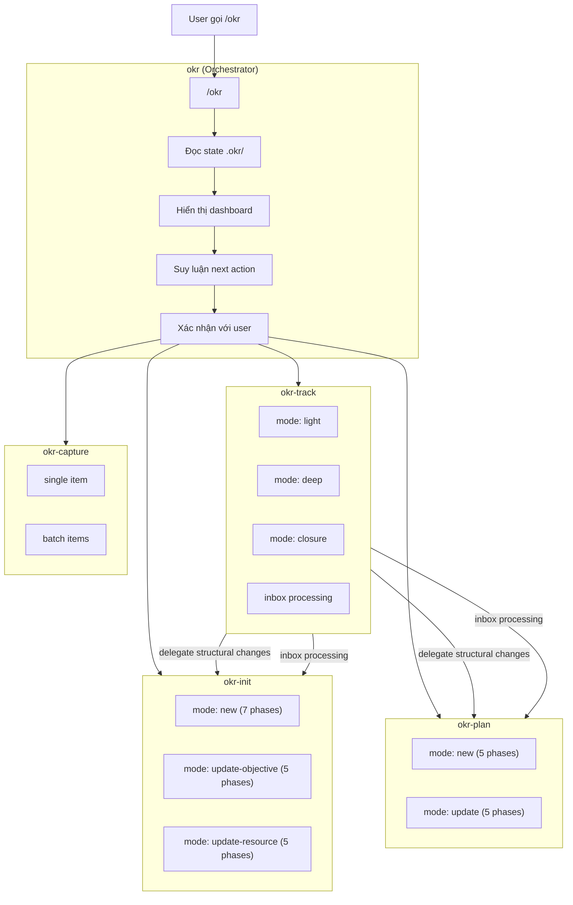
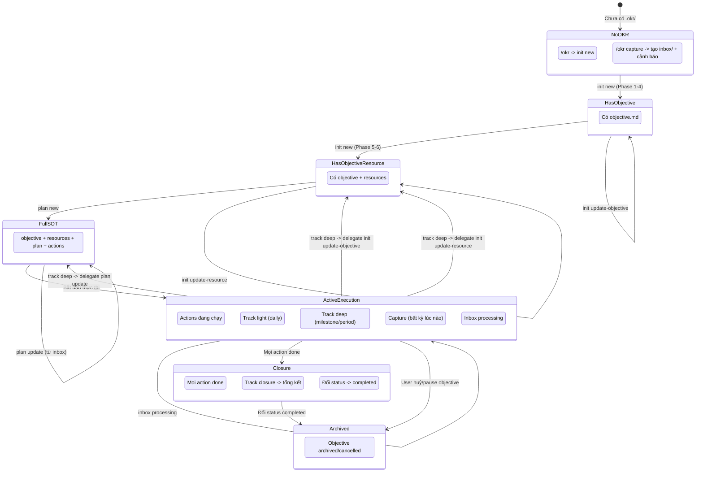
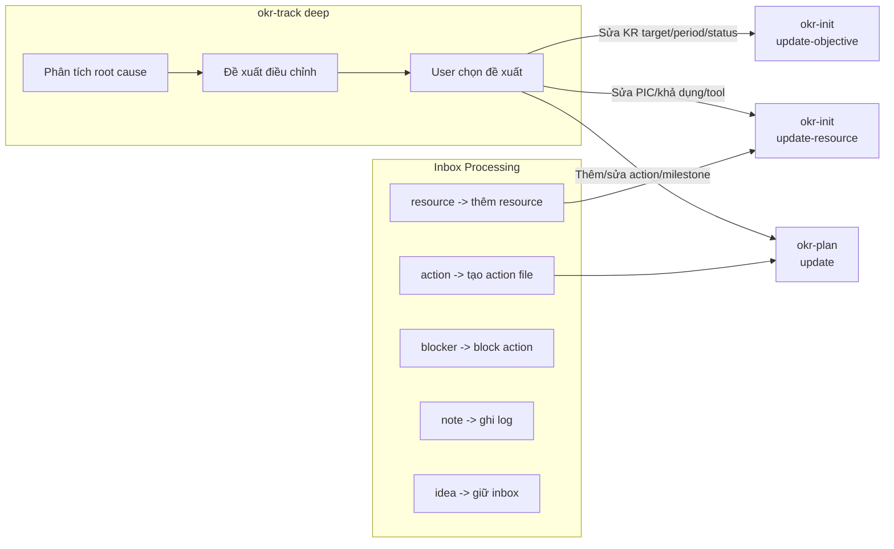
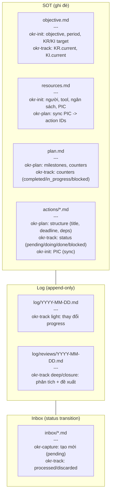

# Đánh giá toàn diện hệ thống OKR Skill

> Ngày: 2026-05-10

## 1. Sơ đồ kiến trúc tổng quan



## 2. Sơ đồ trạng thái (tất cả đường đi)



## 3. Sơ đồ delegate chain (cross-skill)



## 4. Sơ đồ dữ liệu (ai ghi gì, ở đâu)



## 5. Ma trận tất cả khả năng (State x Intent x Action)

| #   | State hiện tại                      | User Intent                  | Route         | Mode               | Ghi chú                 |
| --- | ----------------------------------- | ---------------------------- | ------------- | ------------------ | ----------------------- |
| 1   | Không có `.okr/`                    | Bất kỳ                       | `okr-init`    | `new`              | Tạo từ đầu              |
| 2   | Không có `.okr/`                    | Capture/ghi nhanh            | `okr-capture` | n/a                | Vẫn tạo `.okr/inbox/`   |
| 3   | Có `objective.md`                   | Nhắc objective/KR/KI         | `okr-init`    | `update-objective` | Menu 4 lựa chọn         |
| 4   | Có `objective.md`                   | Nhắc người/tool/PIC          | `okr-init`    | `update-resource`  | Menu 7 lựa chọn         |
| 5   | Có objective + resource, thiếu plan | Bất kỳ liên quan plan        | `okr-plan`    | `new`              | Tạo plan + actions      |
| 6   | Có objective + resource, thiếu plan | User bỏ qua resource         | `okr-plan`    | `new`              | Cảnh báo thiếu resource |
| 7   | Đủ SOT + action đang mở             | Update tiến độ               | `okr-track`   | `light`            | Chỉ progress fields     |
| 8   | Đủ SOT + action đang mở             | Review/tổng kết              | `okr-track`   | `deep`             | Phân tích + delegate    |
| 9   | Đủ SOT + mọi action done            | Bất kỳ                       | `okr-track`   | `closure`          | Tổng kết + lessons      |
| 10  | Đủ SOT + action đang mở             | Thêm/sửa action              | `okr-plan`    | `update`           | Menu 6 lựa chọn         |
| 11  | Đủ SOT + action đang mở             | Dời deadline objective       | `okr-init`    | `update-objective` | Sửa period              |
| 12  | Đủ SOT + action đang mở             | Đổi PIC                      | `okr-init`    | `update-resource`  | Sync actions/           |
| 13  | Đủ SOT + action đang mở             | Capture                      | `okr-capture` | n/a                | Thêm vào inbox          |
| 14  | Đủ SOT + action đang mở             | Xử lý inbox                  | `okr-track`   | inbox processing   | Delegate hoặc tự xử lý  |
| 15  | Đủ SOT (ongoing)                    | Check-in định kỳ             | `okr-track`   | `light`            | Update KI status        |
| 16  | Đủ SOT (ongoing)                    | Review chu kỳ                | `okr-track`   | `deep`             | KI trend analysis       |
| 17  | Đủ SOT (ongoing)                    | Tạo action cải thiện KI      | `okr-plan`    | `update`           | Thêm action file        |
| 18  | Đủ SOT                              | `/okr status`                | Chỉ hiển thị  | n/a                | Không kích hoạt skill   |
| 19  | Bất kỳ                              | `/okr init new`              | `okr-init`    | `new`              | Cảnh báo ghi đè         |
| 20  | Bất kỳ                              | `/okr init update-objective` | `okr-init`    | `update-objective` | Bỏ qua state-check      |
| 21  | Bất kỳ                              | `/okr init update-resource`  | `okr-init`    | `update-resource`  | Bỏ qua state-check      |
| 22  | Bất kỳ                              | `/okr plan new`              | `okr-plan`    | `new`              | Cảnh báo ghi đè         |
| 23  | Bất kỳ                              | `/okr plan update`           | `okr-plan`    | `update`           | Cần có plan.md          |
| 24  | Bất kỳ                              | `/okr resource`              | `okr-init`    | `update-resource`  | Alias                   |
| 25  | Bất kỳ                              | `/okr track light`           | `okr-track`   | `light`            | Bỏ qua auto-detect      |
| 26  | Bất kỳ                              | `/okr track deep`            | `okr-track`   | `deep`             | Bỏ qua auto-detect      |
| 27  | Bất kỳ                              | `/okr track closure`         | `okr-track`   | `closure`          | Bỏ qua auto-detect      |
| 28  | Bất kỳ                              | `/okr capture` / `/okr add`  | `okr-capture` | n/a                | Bỏ qua state-check      |
| 29  | Bất kỳ                              | `/okr inbox`                 | `okr-track`   | inbox-only         | Skip progress update    |
| 30  | Bất kỳ                              | Mơ hồ, không rõ intent       | Hỏi user      | n/a                | "Bạn muốn làm gì?"      |


---

## 6. Review chi tiết

### 6.1 Điểm mạnh (9 điểm)

| #   | Điểm                               | Đánh giá                                                                                         |
| --- | ---------------------------------- | ------------------------------------------------------------------------------------------------ |
| 1   | **Single entry point**             | Thiết kế orchestrator + router rất tốt. User không cần nhớ tên skill con.                        |
| 2   | **Phân vai SOT rõ ràng**           | Mỗi field chỉ 1 skill được sửa. Không chồng lấn. Track chỉ sửa progress, init/plan sửa cấu trúc. |
| 3   | **Quality Gate ngầm**              | 3 câu kiểm tra (đủ cụ thể, giả định ẩn, mâu thuẫn) chạy tự động giúp đào sâu.                    |
| 4   | **Confirm bắt buộc trước khi ghi** | An toàn, tránh ghi sai không recover được.                                                       |
| 5   | **Phân biệt Project vs Ongoing**   | Rõ ràng, khác biệt có ý nghĩa (deadline vs duy trì, KR vs KI).                                   |
| 6   | **Cross-check resource vs scope**  | Tự tính capacity vs scope, cảnh báo bất hợp lý.                                                  |
| 7   | **Deepening techniques cụ thể**    | Mỗi khía cạnh có kỹ thuật đào sâu riêng, không chung chung.                                      |
| 8   | **Inbox capture không chặn flow**  | Ghi nhanh, xử lý sau. Giảm ma sát.                                                               |
| 9   | **Log append-only**                | Lịch sử không bị mất.                                                                            |


### 6.2 Vấn đề phát hiện (12 vấn đề)

#### Vấn đề 1: Quá nhiều điểm confirm gây mệt mỏi

**Mức độ**: Trung bình

| Flow          | Số lần confirm                                   |
| ------------- | ------------------------------------------------ |
| Init NEW      | 2 (Objective + Resource)                         |
| Plan NEW      | 1 (Plan)                                         |
| Track LIGHT   | 1 (Changes)                                      |
| Track DEEP    | 1 (Đề xuất) + N lần (mỗi delegate confirm riêng) |
| Track CLOSURE | 1 (Đề xuất) + delegate confirm                   |
| Inbox batch   | 1 (Chọn items) + delegate confirm                |


Track DEEP là nặng nhất: user confirm đề xuất, rồi từng skill delegate lại hỏi confirm lần nữa. Một lần deep review có thể qua 3-4 lần confirm.

#### Vấn đề 2: Delegate chain đứt context

Khi track deep delegate sang init/plan, context gốc (lý do thay đổi, phân tích root cause) có thể bị mất hoặc không được truyền đầy đủ. Skill nhận delegate không biết "tại sao" lại có thay đổi này.

#### Vấn đề 3: Không có cơ chế rollback/undo

Không có cách nào quay lại trạng thái trước khi sửa SOT. Log là append-only nhưng không có "checkpoint" để revert. Nếu user confirm sai, không có đường lui.

#### Vấn đề 4: Cross-skill impact analysis thiếu

Khi `okr-init` sửa KR target, hoặc `okr-plan` dời milestone, không có cảnh báo tự động về tác động dây chuyền. Chỉ có dòng nhắc "Chạy `/okr` để check tác động" - user phải nhớ làm thủ công.

#### Vấn đề 5: Ongoing type bị đối xử không đều

| Khía cạnh       | Project                 | Ongoing          |
| --------------- | ----------------------- | ---------------- |
| Dashboard       | Có progress bar, tốc độ | Chỉ KI status    |
| Actions         | Đầy đủ                  | "CÓ THỂ tạo"     |
| Milestones      | Bắt buộc                | "Không bắt buộc" |
| Closure         | Có mode riêng           | Không có         |
| Effort tracking | Có                      | Không            |


Ongoing như "công dân hạng hai". Nhưng thực tế, Ongoing mới là loại mục tiêu phổ biến trong đời sống cá nhân.

#### Vấn đề 6: Keyword router dễ nhầm

Một số từ khoá chồng lấn hoặc mơ hồ:

- "đổi deadline" -> có thể là objective period hoặc action due_date
- "cập nhật" -> có thể là track light hoặc plan update
- "thêm người" -> có thể là update-resource hoặc thêm action (nếu user nói "thêm người làm X")

Router dựa trên keyword matching đơn giản, không phân tích ngữ cảnh.

#### Vấn đề 7: Inbox xử lý bị trễ

Inbox chỉ được xử lý SAU khi track. Nếu user không chạy track thường xuyên, inbox tích tụ. Không có reminder hay trigger tự động.

#### Vấn đề 8: Thiếu dashboard tổng quan khi có nhiều objective

Hệ thống thiết kế cho 1 objective / 1 thư mục `.okr/`. Nếu user có nhiều project/ongoing (nhiều thư mục), không có dashboard tổng để xem tất cả cùng lúc.

#### Vấn đề 9: Quality Gate chạy ẩn, user không hiểu tại sao bị hỏi thêm

Quality Gate chạy ngầm ("KHÔNG hiển thị cho user"). Khi fail, agent follow-up đột ngột. User có thể thấy khó chịu vì không hiểu tại sao agent "cố chấp" hỏi sâu.

#### Vấn đề 10: Log review và log thường tách biệt, khó tra cứu

2 thư mục log khác nhau. Muốn xem toàn bộ lịch sử 1 tuần, phải đọc cả 2 nơi. Không có unified log view.

#### Vấn đề 11: Không có estimation review

Plan NEW có estimate effort (xs/s/m/l/xl) nhưng track không có bước so sánh estimate vs actual. Không học được từ sai số ước lượng.

#### Vấn đề 12: Không có cơ chế "đóng băng" period

Khi period kết thúc (Project) hoặc review cycle tới (Ongoing), không có trigger tự động. User phải nhớ chạy track deep/closure.

---

## 7. Kế hoạch cải tiến

### Nhóm A: Sửa ngay (impact cao, effort thấp)

| #   | Cải tiến                                          | Vấn đề giải quyết          | Cách làm                                                                                                    |
| --- | ------------------------------------------------- | -------------------------- | ----------------------------------------------------------------------------------------------------------- |
| A1  | **Thêm skip confirm cho track light**             | #1 (quá nhiều confirm)     | Nếu chỉ update action status (không đổi KR), cho phép confirm nhanh 1 dòng thay vì bảng đầy đủ              |
| A2  | **Truyền context "tại sao" khi delegate**         | #2 (đứt context)           | Khi track delegate sang init/plan, kèm 1 câu "Lý do: [root cause từ track deep]"                            |
| A3  | **Thêm impact check tự động sau khi sửa SOT**     | #4 (thiếu impact analysis) | Sau khi init/plan ghi file, tự đọc lại plan.md + actions và cảnh báo nếu KR target thay đổi làm mất cân đối |
| A4  | **Gom confirm khi delegate nhiều skill cùng lúc** | #1 (quá nhiều confirm)     | Khi track deep có nhiều đề xuất -> gom thành 1 bảng confirm duy nhất trước khi delegate                     |
| A5  | **Thêm reminder inbox định kỳ**                   | #7 (inbox tích tụ)         | Khi dashboard hiển thị, nếu inbox >=5 items -> tự động nhắc "Inbox có N items, xử lý ngay?"                 |


### Nhóm B: Làm trong 1-2 tuần (impact cao, effort trung bình)

| #   | Cải tiến                                               | Vấn đề giải quyết             | Cách làm                                                                                                                                                         |
| --- | ------------------------------------------------------ | ----------------------------- | ---------------------------------------------------------------------------------------------------------------------------------------------------------------- |
| B1  | **Nâng cấp router: intent-based thay vì keyword-only** | #6 (router nhầm)              | Thêm bước phân tích intent: trước khi match keyword, paraphrase lại câu user thành "Tôi muốn [hành động] [đối tượng]" rồi mới route                              |
| B2  | **Unified log view**                                   | #10 (log tách biệt)           | Thêm mode `/okr log` hoặc `/okr history`: đọc cả `log/` và `log/reviews/` trong khoảng thời gian, merge thành 1 timeline                                         |
| B3  | **Estimate vs Actual tracking**                        | #11 (thiếu review estimation) | Trong track deep, thêm bảng so sánh: mỗi action done -> effort estimate vs actual time. Tính % sai số. Hiển thị xu hướng (ước lượng ngày càng sát hơn hay không) |
| B4  | **Ongoing type parity**                                | #5 (ongoing bị bỏ rơi)        | Thêm mode closure cho Ongoing (khi user muốn archive). Thêm "practices adherence" metric vào dashboard Ongoing.                                                  |
| B5  | **Cross-skill impact analysis**                        | #4 (thiếu impact analysis)    | Khi objective.md thay đổi (KR target, period), tự động quét plan.md + actions và hiển thị bảng "Tác động dự kiến"                                                |


### Nhóm C: Cân nhắc dài hạn (effort cao)

| #   | Cải tiến                       | Vấn đề giải quyết      | Cách làm                                                                                                        |
| --- | ------------------------------ | ---------------------- | --------------------------------------------------------------------------------------------------------------- |
| C1  | **Multi-objective dashboard**  | #8 (thiếu tổng quan)   | `/okr all`: quét tất cả thư mục `.okr/` trong workspace, hiển thị dashboard tổng                                |
| C2  | **Checkpoint/version cho SOT** | #3 (không có undo)     | Trước mỗi lần ghi đè SOT, tự động backup ra `.okr/.history/objective.2026-05-10.md`. Kèm `/okr undo` để revert. |
| C3  | **Tự động nhắc review**        | #12 (không có trigger) | Khi dashboard hiển thị, nếu period đã qua 50% hoặc đến ngày review_cycle -> tự động đề xuất mode deep           |
| C4  | **Quality Gate minh bạch**     | #9 (quality gate ẩn)   | Khi fail quality gate, hiển thị ngắn: "Mình đào sâu thêm chút vì [lý do cụ thể]" thay vì im lặng follow-up      |


---

## 8. Thứ tự triển khai đề xuất

```
Đợt 1 (ngay): A1, A2, A4, A5 -> giảm ma sát confirm, cải thiện delegate
Đợt 2 (1-2 tuần): B1, B5, B3 -> router thông minh hơn, impact analysis, estimate tracking
Đợt 3 (dài hạn): C3, C2, C1 -> reminder tự động, undo, multi-objective
```

---

## 9. Phân vai SOT (tham chiếu nhanh)

Bảng canonical ở `CLAUDE.md` section "Phân vai SOT" (single source). Không lặp lại ở đây để tránh drift. Tham chiếu nhanh: `okr-init update-objective` sửa objective/KR/KI/period/status; `okr-init update-resource` sửa Solo Profile/tool/ngân sách; `okr-plan update` sửa milestones + action structure; `okr-track light/deep` sửa progress fields; `okr-capture` tạo inbox item; `okr-track` xử lý inbox status transition.


## 10. Cấu trúc thư mục dữ liệu

```
.okr/
├── objective.md       # SOT mục tiêu + KR/KI       (okr-init)
├── resources.md       # SOT người + tool + ngân sách (okr-init)
├── plan.md            # SOT milestones + counters    (okr-plan)
├── actions/           # SOT 1 file/action            (okr-plan + okr-track)
│   └── archive/       # Actions done (read-only)      (okr-track archive)
├── inbox/             # Capture items chờ xử lý      (okr-capture -> okr-track)
└── log/               # Append-only                  (okr-track)
    └── reviews/       # Deep/closure reviews          (okr-track deep/closure)
```

## 11. Luồng dữ liệu chính

### Tầng dữ liệu

| Tầng           | Vị trí                                                     | Hành vi                                            |
| -------------- | ---------------------------------------------------------- | -------------------------------------------------- |
| **SOT**        | `.okr/objective.md`, `plan.md`, `resources.md`, `actions/` | Ghi đè                                             |
| **Log thường** | `.okr/log/YYYY-MM-DD.md`                                   | Append-only                                        |
| **Log review** | `.okr/log/reviews/YYYY-MM-DD.md`                           | Append-only                                        |
| **Inbox**      | `.okr/inbox/*.md`                                          | Status transition (pending -> processed/discarded) |


### Progress vs Structure fields

**Progress fields (track mode light hoặc deep được ghi đè):**

- `.okr/objective.md`: cột `Current`, `Status` trong bảng KR/KI
- `.okr/plan.md`: frontmatter counters (`total_actions`, `completed`, `in_progress`, `blocked`), milestones[].status
- `.okr/actions/AXXX-*.md`: frontmatter `status` (pending/doing/done/blocked)

**Structure fields (track chỉ đề xuất, delegate để apply):**

| Field                                                                   | Skill áp dụng                 |
| ----------------------------------------------------------------------- | ----------------------------- |
| `objective` text, `quarter`, `start_date`, `end_date`                   | `okr-init` `update-objective` |
| KR target, KR baseline, thêm/xoá KR                                     | `okr-init` `update-objective` |
| `objective.md` frontmatter `status` (active/paused/completed/cancelled) | `okr-init` `update-objective` |
| Resource: người, tool, ngân sách, PIC, khả dụng                         | `okr-init` `update-resource`  |
| Action: title, description, due_date, depends_on, deliverable           | `okr-plan` `update`           |
| Thêm/xoá action                                                         | `okr-plan` `update`           |
| Milestone deadline, thêm/xoá milestone                                  | `okr-plan` `update`           |


### Inbox xử lý

| Inbox type | Xử lý                                                         | Ai thực hiện                                  |
| ---------- | ------------------------------------------------------------- | --------------------------------------------- |
| `action`   | Chuyển thành action file trong `actions/`, cập nhật `plan.md` | Delegate -> `okr-plan` mode `update`          |
| `idea`     | User chọn: giữ inbox / chuyển thành action / bỏ               | Tuỳ lựa chọn                                  |
| `blocker`  | Đánh dấu action liên quan = `blocked` + ghi lý do             | `okr-track` tự xử lý (progress field)         |
| `resource` | Thêm người/tool/doc vào resources.md                          | Delegate -> `okr-init` mode `update-resource` |
| `note`     | Append vào `log/YYYY-MM-DD.md`                                | `okr-track` tự xử lý                          |


### Inbox status transitions

```
pending -> processed   (đã xử lý: tạo action, update resource, ghi log...)
pending -> discarded   (user quyết định bỏ)
pending -> pending     (giữ inbox, chờ rõ hơn)
```
