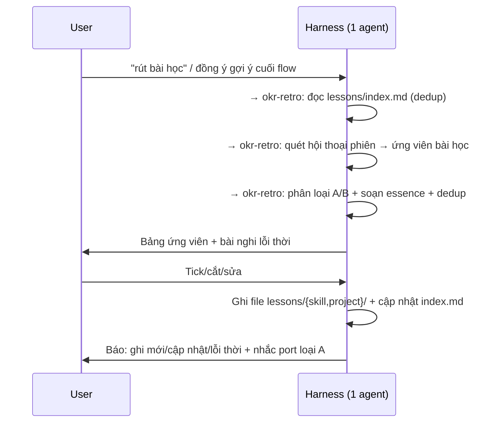

# okr-retro (Layer Lessons) Implementation Plan

> **For agentic workers:** REQUIRED SUB-SKILL: Use superpowers:subagent-driven-development (recommended) or superpowers:executing-plans to implement this plan task-by-task. Steps use checkbox (`- [ ]`) syntax for tracking.

**Goal:** Thêm skill thứ 8 `okr-retro` rút bài học từ phiên làm việc OKR, lưu thành layer `.okr/lessons/` auto-load mỗi phiên, đồng thời gỡ cơ chế "Tự cải tiến" + CHANGELOG cũ khỏi `okr-harness`.

**Architecture:** Skill-only inline, đúng kiến trúc hiện tại (1 agent đọc SKILL.md và thực thi, không sub-agent, không hook). `okr-retro` record-only: trích bài học → trình bảng confirm → ghi file theo template + cập nhật `index.md`. Bài học chia 2 loại: A (cải tiến skill, hàng đợi port thủ công về repo gốc) và B (project cụ thể, sống tại chỗ). Auto-load = `okr-harness` Phase 1 đọc `.okr/lessons/index.md`.

**Tech Stack:** Markdown prompt thuần. KHÔNG có test runner. "Verification" = (1) grep consistency check, (2) dry-run kịch bản trong SKILL.md, (3) `ls`/đọc file xác nhận tồn tại + đúng format.

---

## Bối cảnh cho engineer (đọc trước khi bắt đầu)

Bạn đang sửa **source code của một harness OKR viết bằng markdown**. Mỗi "skill" là 1 thư mục trong `.claude/skills/` gồm `SKILL.md` (prompt chính) + `references/*.md` (load on-demand). Không có code chạy, không có test tự động. Một "skill chạy" nghĩa là agent đọc file markdown đó và làm theo.

Quy tắc bất biến của repo (đừng phá):
- **Skill-only**: KHÔNG tạo `.claude/agents/`, KHÔNG hook, KHÔNG `settings.json`. Deploy = copy `.claude/skills/`.
- **SOT ownership**: mỗi field/dữ liệu chỉ 1 skill được ghi. Canonical: `.claude/skills/okr-shared/references/sot-ownership.md`.
- **Confirm trước ghi**: skill ghi dữ liệu phải trình bảng cho user duyệt trước.
- **Tiết kiệm token**: chỉ auto-load thứ nhỏ + cần thiết.
- **Tiếng Việt đầy đủ dấu** trong mọi nội dung markdown. Cấm em-dash `—`, cấm `---` (trừ dấu phân cách frontmatter YAML và separator markdown hợp lệ).
- **Consistency**: cùng một concept phải mô tả giống nhau ở mọi file.

### Các quyết định thiết kế đã chốt (từ phiên grill)

| # | Quyết định |
|---|-----------|
| Tên | Skill `okr-retro`, folder runtime `.okr/lessons/` |
| Auto-load | `okr-harness` Phase 1 đọc `.okr/lessons/index.md` (chỉ index, không đọc detail) |
| Trigger | Hybrid: harness gợi ý 1 dòng cuối flow, user chủ động kích hoạt mới chạy. KHÔNG tự chạy ngầm |
| Cấu trúc | `index.md` + `skill/` (loại A) + `project/` (loại B), file lẻ theo template unified |
| Mức load | Chỉ `index.md`; detail on-demand |
| Loại A | Record-only, `status: pending`, user thủ công port về repo gốc objective-kit |
| Template | 1 template unified, field `type` chuyển loại; `target` (skill) / `area` (project) optional |
| Ghi | Trình bảng ứng viên → user tick/cắt → ghi. Trùng thì cập nhật bài cũ (không đẻ bản mới) |
| CHANGELOG | Gỡ cơ chế ghi CHANGELOG khỏi skill (gỡ "Tự cải tiến" + "Ghi nhận thay đổi" trong harness). File `CHANGELOG.md` gốc của repo GIỮ LẠI |
| Phạm vi | Trích xuất + tự dọn nhẹ (nêu bài loại B nghi lỗi thời). Port loại A = thủ công |
| Độ bền load | Harness là cửa vào + 1 dòng an toàn trong okr-shared |

---

## File Structure

**Tạo mới (2 file):**
- `.claude/skills/okr-retro/references/data-format.md` — schema: cây thư mục, template bài học, format index, status values.
- `.claude/skills/okr-retro/SKILL.md` — skill chính: trigger, flow trích xuất, dedup, confirm, ghi, tự dọn, test scenarios.

**Sửa (7 file):**
- `.claude/skills/okr-harness/SKILL.md` — description (thêm trigger retro), Bản đồ skill (thêm row), Phase 1 Preload (load lessons index), Intent routing (thêm row), GỠ "Tự cải tiến" + "Ghi nhận thay đổi", thêm "## Rút bài học", Phase 3 (bullet nudge).
- `.claude/skills/okr-harness/references/skill-contract.md` — thêm section I/O của okr-retro.
- `.claude/skills/okr-harness/references/flows.md` — thêm "## 7. Retro flow".
- `.claude/skills/okr-shared/references/sot-ownership.md` — thêm row `.okr/lessons/**` → okr-retro.
- `.claude/skills/okr-shared/SKILL.md` — thêm note auto-load lessons (dòng an toàn).
- `CLAUDE.md` — 8 skills, diagram, skill table, SOT table, runtime structure, deploy text, Lịch sử Đợt 10.
- `CHANGELOG.md` — thêm row Đợt 10.

---

## Task 1: Tạo schema `okr-retro/references/data-format.md`

Đây là nền móng. SKILL.md sẽ link tới file này. Làm trước để các task sau tham chiếu được.

**Files:**
- Create: `.claude/skills/okr-retro/references/data-format.md`

- [ ] **Step 1: Tạo file data-format.md với nội dung đầy đủ**

Tạo file `.claude/skills/okr-retro/references/data-format.md` với nội dung CHÍNH XÁC sau:

````markdown
# Data Format: Lessons (okr-retro)

Schema cho layer bài học. SOT của `okr-retro`. Sinh tại project đích, dưới `.okr/`.

## Cây thư mục

```
.okr/lessons/
├── index.md              # Overview + link. AUTO-LOAD mỗi phiên OKR.
├── skill/                # Loại A: bài học cải tiến bộ skill OKR
│   └── Sxxx-slug.md
└── project/              # Loại B: bài học về project đang làm
    └── Pxxx-slug.md
```

- Loại A (`skill/`): hàng đợi cải tiến harness. Record-only, user thủ công port về repo gốc `objective-kit`.
- Loại B (`project/`): tri thức về project đích, sống tại chỗ.

## File bài học (template unified)

Tên file: `Sxxx-slug.md` (skill) hoặc `Pxxx-slug.md` (project). `xxx` = số 3 chữ số tăng dần, đếm riêng từng loại.

```yaml
---
id: P001                 # S### cho skill, P### cho project
type: project            # skill | project
status: active           # skill: pending | ported  ·  project: active | obsolete
date: "YYYY-MM-DD"        # ngày trích xuất
target:                  # CHỈ khi type=skill: file/skill cần sửa (vd okr-track/flow-deep.md). type=project bỏ trống.
area:                    # CHỈ khi type=project: mảng tri thức (vd "định nghĩa KR", "capacity"). type=skill bỏ trống.
tags: []
essence: "Câu lõi hành động 1 dòng. Đây là dòng đưa lên index."
---

## Bối cảnh
[Phiên này xảy ra gì dẫn tới bài học. 1-3 câu.]

## Bài học
[Lần sau làm khác đi thế nào. Rule cụ thể, actionable.]

## Bằng chứng
[Link action/log/file hoặc trích dẫn chứng minh. Nếu không có artifact, ghi "phiên YYYY-MM-DD".]
```

## Index (`index.md`)

Auto-load mỗi phiên. CHỈ chứa dòng tóm tắt, KHÔNG chứa body bài học. Hai bảng theo loại.

```markdown
# Lessons Index

> Auto-load mỗi phiên OKR. Bài học chi tiết: file trong `skill/` và `project/`.
> Loại A (skill) là hàng đợi cải tiến harness, port thủ công về repo gốc objective-kit.

## Cải tiến bộ skill OKR (loại A)

| ID | Essence | Target | Status | Link |
|----|---------|--------|--------|------|
| S001 | Câu lõi 1 dòng | okr-track/flow-light.md | pending | [S001](skill/S001-slug.md) |

## Project: <tên project> (loại B)

| ID | Essence | Area | Status | Link |
|----|---------|------|--------|------|
| P001 | Câu lõi 1 dòng | định nghĩa KR | active | [P001](project/P001-slug.md) |

## Lưu trữ (ported / obsolete)

> Bài đã port hoặc lỗi thời. Giữ để trace, không lái hành vi.

| ID | Essence | Status | Link |
|----|---------|--------|------|
```

- Cột `Target` (loại A) = file skill cần sửa. Cột `Area` (loại B) = mảng tri thức (tự do).
- Bảng A và B chỉ liệt kê bài còn hiệu lực (`pending` / `active`).
- Bài `ported` / `obsolete` chuyển xuống mục "Lưu trữ".

## Status values

| Loại | Status | Nghĩa |
|------|--------|-------|
| skill | `pending` | Chưa port về repo gốc |
| skill | `ported` | User đã port + cải tiến ở source |
| project | `active` | Còn đúng, còn áp dụng |
| project | `obsolete` | Không còn đúng (objective đổi, đã khắc phục) |

## Quy ước

- Mỗi bài = 1 file (dễ port/xoá từng cái).
- `id` tăng dần riêng từng loại (S001, S002... · P001, P002...). Tìm max id hiện có trong thư mục tương ứng rồi +1.
- Slug: tiếng Việt không dấu hoặc tiếng Anh, ≤5 từ, gạch ngang.
- `essence` là SOT của dòng index: sửa essence trong file thì cập nhật lại dòng index.
- Trùng bài: cập nhật file cũ (tinh chỉnh essence, có thể thêm ngày gặp lại vào Bối cảnh), KHÔNG tạo file mới.
````

- [ ] **Step 2: Verify file tồn tại + đúng cấu trúc**

Run:
```bash
ls -la .claude/skills/okr-retro/references/data-format.md && \
grep -c "type: project" .claude/skills/okr-retro/references/data-format.md && \
grep -n "## Cây thư mục\|## File bài học\|## Index\|## Status values\|## Quy ước" .claude/skills/okr-retro/references/data-format.md
```
Expected: file tồn tại; grep "type: project" trả về `1`; 5 heading liệt kê đủ.

- [ ] **Step 3: Commit**

```bash
git add .claude/skills/okr-retro/references/data-format.md
git commit -m "feat(okr-retro): add lessons data-format schema (template, index, status)"
```

---

## Task 2: Tạo `okr-retro/SKILL.md`

**Files:**
- Create: `.claude/skills/okr-retro/SKILL.md`

- [ ] **Step 1: Tạo SKILL.md với nội dung đầy đủ**

Tạo file `.claude/skills/okr-retro/SKILL.md` với nội dung CHÍNH XÁC sau:

````markdown
---
name: okr-retro
description: "Rút bài học từ phiên làm việc OKR và lưu vào layer lessons. Trigger khi user nhắc: rút bài học, tổng kết phiên, retro, bài học, lesson, lesson learned, học được gì, nhìn lại phiên. Trích xuất tự động từ hội thoại hiện tại, phân 2 loại (cải tiến skill / project cụ thể), confirm bảng trước khi ghi. Record-only, không tự sửa skill."
---

# OKR Retro: Rút bài học từ phiên

Chạy inline. Trích bài học từ hội thoại phiên hiện tại, phân loại, ghi vào `.okr/lessons/`. **Record-only**: KHÔNG tự sửa skill, KHÔNG tự áp dụng cải tiến.

## Khi nào chạy

- **User chủ động**: "rút bài học", "tổng kết phiên", "retro".
- **Harness gợi ý cuối flow** (1 dòng), user đồng ý mới chạy. KHÔNG tự chạy ngầm.

## Hai loại bài học

| Loại | Là gì | Lưu ở | Vòng đời |
|------|-------|-------|----------|
| A — Cải tiến skill | Bài học về chính bộ skill OKR (flow vướng, routing sai, thiếu field, mô tả không trigger) | `.okr/lessons/skill/` | Record-only, `pending` → user port về repo gốc → `ported` |
| B — Project cụ thể | Tri thức về project đang làm (định nghĩa KR, ước lượng capacity, đặc thù domain) | `.okr/lessons/project/` | `active` → `obsolete` khi hết đúng |

Phân biệt nhanh: sửa được bằng cách đổi file trong `.claude/skills/` → **loại A**. Về nội dung công việc/mục tiêu → **loại B**.

## Flow

### Bước 1: Đọc index hiện có
Đọc `.okr/lessons/index.md` (nếu chưa có trong context). Dùng để dedup. Folder chưa tồn tại → sẽ tạo khi ghi (Bước 6).

### Bước 2: Quét phiên
Nhìn lại TOÀN BỘ hội thoại phiên hiện tại (kể cả phần không phải OKR). Tìm khoảnh khắc sinh bài học:
- Chỗ user sửa/bác bỏ cách làm của bạn.
- Chỗ vướng, làm lại, hiểu nhầm rồi vỡ ra.
- Quy ước/ràng buộc/đặc thù project mới lộ ra.
- Giới hạn/lỗi/điểm khó dùng của bộ skill.

### Bước 3: Lọc theo chất lượng
Chỉ giữ bài học **tái dùng được + không hiển nhiên + actionable**. Bỏ:
- Sự kiện một lần, không lặp lại.
- Điều quá hiển nhiên ("nên đọc file trước khi sửa").
- Việc đã ghi sẵn trong skill/CLAUDE.md.

### Bước 4: Phân loại + soạn essence + dedup
Mỗi bài: gán `type` (A/B), soạn `essence` 1 dòng (câu lõi hành động), gán `target` (loại A) hoặc `area` (loại B). Đối chiếu index: trùng/giao bài cũ → đánh dấu "Cập nhật Sxxx/Pxxx" thay vì tạo mới.

### Bước 5: Trình bảng ứng viên + tự dọn nhẹ
Hiển thị bảng cho user tick/cắt/sửa:

```
| # | Loại | Essence | Target/Area | Mới/Cập nhật |
|---|------|---------|-------------|--------------|
| 1 | A | ... | okr-plan/flow-new.md | Mới |
| 2 | B | ... | capacity | Cập nhật P003 |
```

Đồng thời nêu bài loại B nghi **lỗi thời** (objective đã đổi, blocker đã hết) để user xác nhận `obsolete`/xoá. Chờ user duyệt. KHÔNG ghi trước khi user chọn.

### Bước 6: Ghi
Với mỗi bài user giữ:
- **Mới**: tạo file theo template (`references/data-format.md`), `id` tăng dần trong loại.
- **Cập nhật**: sửa file cũ (tinh chỉnh essence/bối cảnh).
- Cập nhật `index.md`: thêm/sửa dòng. Bài `obsolete`/`ported` chuyển mục "Lưu trữ".
- Folder `.okr/lessons/` chưa có → tạo `index.md` + `skill/` + `project/`.

### Bước 7: Báo cáo
Tóm tắt: ghi mới mấy bài, cập nhật mấy, đánh dấu lỗi thời mấy. Nếu có loại A `pending` → nhắc: "X bài cải tiến skill đang chờ port về repo gốc objective-kit."

## Quy tắc

- **Record-only**. KHÔNG sửa file trong `.claude/skills/`. KHÔNG tự áp dụng cải tiến.
- **Confirm trước ghi** (bảng ứng viên).
- **Trùng thì cập nhật**, không đẻ bản mới.
- **SOT**: chỉ `okr-retro` ghi `.okr/lessons/**`. Xem `okr-shared/references/sot-ownership.md`.
- **Schema**: `references/data-format.md`.

## Test scenarios

### Trích xuất sau phiên track
1. User vừa track xong, gõ "rút bài học".
2. okr-retro đọc index, quét hội thoại.
3. Tìm thấy: user phàn nàn flow track hỏi quá nhiều (loại A, target `okr-track/flow-light.md`) + nhận ra KR2 đặt baseline sai (loại B, area "định nghĩa KR").
4. Trình bảng 2 ứng viên. User giữ cả 2.
5. Ghi S001 + P001, cập nhật index.
6. Báo: "Ghi 2 bài. 1 bài cải tiến skill (S001) chờ port về repo gốc."

### Dedup
1. Phiên sau, user lại "rút bài học".
2. Bài về capacity trùng P002 đã có.
3. Bảng đánh dấu "Cập nhật P002". User đồng ý.
4. Tinh chỉnh essence P002, KHÔNG tạo P00x mới.

### Không có bài học đáng ghi
1. Phiên ngắn, chỉ xem dashboard.
2. okr-retro quét, không có gì tái dùng được.
3. Báo: "Phiên này chưa có bài học đáng ghi." Không ghi gì.
````

- [ ] **Step 2: Verify SKILL.md đúng cấu trúc + frontmatter hợp lệ**

Run:
```bash
ls -la .claude/skills/okr-retro/SKILL.md && \
head -4 .claude/skills/okr-retro/SKILL.md && \
grep -n "## Khi nào chạy\|## Hai loại bài học\|## Flow\|## Quy tắc\|## Test scenarios" .claude/skills/okr-retro/SKILL.md && \
grep -c "Record-only" .claude/skills/okr-retro/SKILL.md
```
Expected: file tồn tại; frontmatter có `name: okr-retro` + `description:`; 5 heading đủ; "Record-only" xuất hiện ≥2 lần.

- [ ] **Step 3: Verify không dùng ký tự cấm**

Run:
```bash
grep -n "—\|–" .claude/skills/okr-retro/SKILL.md .claude/skills/okr-retro/references/data-format.md || echo "OK: khong co em-dash/en-dash"
```
Expected: in `OK: khong co em-dash/en-dash` (không có dòng nào chứa em-dash/en-dash).

- [ ] **Step 4: Dry-run kịch bản "Không có bài học đáng ghi"**

Đọc lại section `## Flow` và `## Test scenarios`. Tự kiểm: nếu phiên không có bài học, Bước 3 lọc hết → Bước 5 bảng rỗng → Bước 7 báo "chưa có bài học đáng ghi", KHÔNG tạo file. Xác nhận flow không buộc tạo file khi rỗng.

Expected: flow xử lý đúng case rỗng (không tạo file thừa).

- [ ] **Step 5: Commit**

```bash
git add .claude/skills/okr-retro/SKILL.md
git commit -m "feat(okr-retro): add SKILL.md (extract, classify, dedup, confirm, record-only)"
```

---

## Task 3: Wire `okr-retro` vào `okr-harness` (routing + auto-load + gỡ cơ chế cũ)

**Files:**
- Modify: `.claude/skills/okr-harness/SKILL.md`

- [ ] **Step 1: Thêm trigger retro vào description (dòng 3)**

Tìm đoạn (trong frontmatter, dòng 3):
```
review sâu, tài nguyên, capacity, inbox, capture, ghi nhanh, dashboard, tiến độ, quá hạn, at-risk, blocker, tổng kết. Cũng trigger khi:
```
Thay bằng:
```
review sâu, tài nguyên, capacity, inbox, capture, ghi nhanh, dashboard, tiến độ, quá hạn, at-risk, blocker, tổng kết, rút bài học, retro, bài học. Cũng trigger khi:
```

- [ ] **Step 2: Thêm row okr-retro vào Bản đồ skill**

Tìm dòng (cuối bảng "## Bản đồ skill"):
```
| `okr-shared`  | Quy tắc chung: SOT, schemas, quality gate, delegate, priority | Không      |
```
Thay bằng (thêm 1 row okr-retro TRƯỚC okr-shared):
```
| `okr-retro`   | Rút bài học từ phiên, ghi `.okr/lessons/` (record-only)       | Có (lessons) |
| `okr-shared`  | Quy tắc chung: SOT, schemas, quality gate, delegate, priority | Không      |
```

- [ ] **Step 3: Thêm load lessons index vào Phase 1 Preload**

Tìm block (trong "### Preload"):
```
objective.md   → type (project/ongoing), status, period
plan.md        → có/không, counters
actions/       → count active, có overdue/blocked?
inbox/         → count pending
```
Thay bằng:
```
objective.md      → type (project/ongoing), status, period
plan.md           → có/không, counters
actions/          → count active, có overdue/blocked?
inbox/            → count pending
lessons/index.md  → đọc TOÀN BỘ (bài học, auto-load mỗi phiên)
```

- [ ] **Step 4: Sửa câu giới hạn đọc trong Preload**

Tìm dòng (ngay sau block trên):
```
Chỉ đọc frontmatter. Không đọc body, log, archive.
```
Thay bằng:
```
Chỉ đọc frontmatter (trừ `lessons/index.md` đọc toàn bộ vì nhỏ, chứa câu lõi bài học). Không đọc body action, log, archive, hay file detail bài học (load on-demand khi cần).
```

- [ ] **Step 5: Thêm row routing okr-retro vào Intent routing table**

Tìm dòng (cuối bảng Intent routing):
```
|                         | "trace / history / xem lại"            | `okr-track` trace                     |
```
Thay bằng:
```
|                         | "trace / history / xem lại"            | `okr-track` trace                     |
|                         | "rút bài học / tổng kết phiên / retro" | `okr-retro`                           |
```

- [ ] **Step 6: Thêm bullet nudge vào Phase 3**

Tìm block "## Phase 3: Tổng hợp":
```
## Phase 3: Tổng hợp

- Gom kết quả các bước.
- Render tóm tắt cho user: thay đổi gì, next step gì.
```
Thay bằng:
```
## Phase 3: Tổng hợp

- Gom kết quả các bước.
- Render tóm tắt cho user: thay đổi gì, next step gì.
- Gợi ý rút bài học nếu flow có thực chất (xem `## Rút bài học`).
```

- [ ] **Step 7: GỠ "Tự cải tiến" + "Ghi nhận thay đổi", thay bằng "## Rút bài học"**

Tìm TOÀN BỘ đoạn từ `## Tự cải tiến` cho tới hết `## Ghi nhận thay đổi` (kết thúc ngay trước `## Tham khảo`). Đoạn cần xoá bắt đầu bằng:
```
## Tự cải tiến

Sau mỗi phiên (trừ capture, trace đơn giản), hỏi user:
```
và kết thúc bằng (dòng cuối của "Ghi nhận thay đổi", ngay trước `## Tham khảo`):
```
File này theo dõi harness tiến hoá theo hướng nào, phòng regression.
```

Thay TOÀN BỘ đoạn đó bằng:
```
## Rút bài học

Thay cho cơ chế tự cải tiến cũ. Việc rút bài học do skill `okr-retro` đảm nhiệm, **user chủ động**.

**Gợi ý cuối flow**: sau khi tổng hợp (Phase 3), với flow có thực chất (track, deep review, init, plan, inbox; trừ dashboard/capture/trace đơn giản), thêm đúng 1 dòng:

> "Muốn rút bài học phiên này? (chạy okr-retro)"

KHÔNG tự chạy. User đồng ý hoặc tự gõ "rút bài học" → chạy `okr-retro` inline.

`okr-retro` ghi 2 loại bài học vào `.okr/lessons/`:
- **Loại A (cải tiến skill)**: hàng đợi, user port thủ công về repo gốc `objective-kit` để cải tiến harness.
- **Loại B (project cụ thể)**: tri thức tại chỗ, auto-load mỗi phiên qua index.

Record-only: `okr-retro` KHÔNG tự sửa file skill, KHÔNG ghi CHANGELOG. Chi tiết: `okr-retro` SKILL.md.
```

- [ ] **Step 8: Verify các thay đổi harness**

Run:
```bash
grep -n "okr-retro\|rút bài học\|lessons/index.md\|## Rút bài học" .claude/skills/okr-harness/SKILL.md && \
echo "--- phai rong (da go): ---" && \
(grep -n "## Tự cải tiến\|## Ghi nhận thay đổi" .claude/skills/okr-harness/SKILL.md || echo "OK: da go co che cu")
```
Expected: thấy okr-retro trong description/bản đồ/routing, "rút bài học", "lessons/index.md", "## Rút bài học"; và in `OK: da go co che cu` (không còn 2 section cũ).

- [ ] **Step 9: Dry-run kịch bản daily check-in (đảm bảo auto-load không vỡ flow)**

Đọc lại "## Phase 1" sau sửa. Tự kiểm: Preload giờ đọc thêm `lessons/index.md`. Nếu file chưa tồn tại (project mới chưa từng retro) → bỏ qua, không lỗi. Xác nhận câu chữ không buộc file phải có.

Expected: flow chịu được trường hợp `lessons/index.md` chưa tồn tại.

- [ ] **Step 10: Commit**

```bash
git add .claude/skills/okr-harness/SKILL.md
git commit -m "feat(okr-harness): route okr-retro, auto-load lessons index, remove old self-improve + changelog mechanism"
```

---

## Task 4: Thêm I/O okr-retro vào `skill-contract.md`

**Files:**
- Modify: `.claude/skills/okr-harness/references/skill-contract.md`

- [ ] **Step 1: Chèn section okr-retro trước "## Chuyển skill inline"**

Tìm dòng:
```
## Chuyển skill inline (thay cho dispatch)
```
Chèn NGAY TRƯỚC dòng đó (thêm 1 section mới + 1 dòng trống):

````markdown
## okr-retro

### Input

| Param | Bắt buộc | Mô tả |
|-------|---------|-------|
| okr_path | Có | Đường dẫn `.okr/` |
| trigger | Không | "user" (chủ động) hoặc "nudge" (gợi ý cuối flow) |

### Output

```yaml
status: success | nothing       # nothing = không có bài học đáng ghi
lessons_added:                  # bài mới
  - id: string                  # Sxxx | Pxxx
    type: skill | project
    essence: string
lessons_updated: [Sxxx, Pxxx]   # bài cập nhật (dedup)
lessons_obsoleted: [Pxxx]       # bài đánh dấu lỗi thời
pending_skill_lessons: number   # loại A pending, nhắc port về repo gốc
```

````

- [ ] **Step 2: Verify**

Run:
```bash
grep -n "## okr-retro\|pending_skill_lessons\|## Chuyển skill inline" .claude/skills/okr-harness/references/skill-contract.md
```
Expected: "## okr-retro" xuất hiện TRƯỚC "## Chuyển skill inline"; có `pending_skill_lessons`.

- [ ] **Step 3: Commit**

```bash
git add .claude/skills/okr-harness/references/skill-contract.md
git commit -m "docs(okr-harness): add okr-retro I/O to skill-contract"
```

---

## Task 5: Thêm "Retro flow" vào `flows.md`

**Files:**
- Modify: `.claude/skills/okr-harness/references/flows.md`

- [ ] **Step 1: Thêm section flow ở cuối file**

Mở `.claude/skills/okr-harness/references/flows.md`, thêm vào CUỐI file (sau "## 6. Inbox flow") nội dung sau:

````markdown

## 7. Retro flow (rút bài học)



Record-only: `okr-retro` KHÔNG sửa file skill. Loại A là hàng đợi port thủ công về repo gốc. Chỉ user chủ động (hoặc đồng ý gợi ý cuối flow) mới chạy.
````

- [ ] **Step 2: Verify**

Run:
```bash
grep -n "## 7. Retro flow\|okr-retro\|Record-only" .claude/skills/okr-harness/references/flows.md
```
Expected: "## 7. Retro flow" tồn tại; có okr-retro; có "Record-only".

- [ ] **Step 3: Commit**

```bash
git add .claude/skills/okr-harness/references/flows.md
git commit -m "docs(okr-harness): add retro flow diagram to flows.md"
```

---

## Task 6: Cập nhật SOT ownership + dòng an toàn auto-load

**Files:**
- Modify: `.claude/skills/okr-shared/references/sot-ownership.md`
- Modify: `.claude/skills/okr-shared/SKILL.md`

- [ ] **Step 1: Thêm row lessons vào bảng SOT (sot-ownership.md)**

Tìm dòng:
```
| External sync (pull/push status)                                  | `okr-track` `light`/`deep`    |
```
Thay bằng (thêm row okr-retro ngay sau):
```
| External sync (pull/push status)                                  | `okr-track` `light`/`deep`    |
| Bài học (`.okr/lessons/**`: tạo/sửa/đánh dấu obsolete, ported)    | `okr-retro`                   |
```

- [ ] **Step 2: Thêm note auto-load lessons vào okr-shared/SKILL.md**

Mở `.claude/skills/okr-shared/SKILL.md`. Tìm dòng cuối cùng (kết của section "## Khi nào đọc", dòng bắt đầu bằng `- **okr-track**:`). Thêm vào CUỐI file section mới:

````markdown

## Auto-load lessons (an toàn)

Layer bài học (`okr-retro`) được `okr-harness` Phase 1 nạp sẵn `.okr/lessons/index.md` mỗi phiên. An toàn: nếu một skill chạy mà `index.md` chưa có trong context và `.okr/lessons/index.md` tồn tại, đọc nó trước khi thao tác. Chỉ đọc `index.md`, không đọc file detail (load on-demand).
````

- [ ] **Step 3: Verify cả hai file**

Run:
```bash
grep -n "okr-retro\|.okr/lessons" .claude/skills/okr-shared/references/sot-ownership.md && \
grep -n "## Auto-load lessons\|okr-retro" .claude/skills/okr-shared/SKILL.md
```
Expected: sot-ownership có row okr-retro + `.okr/lessons`; SKILL.md có "## Auto-load lessons" + okr-retro.

- [ ] **Step 4: Commit**

```bash
git add .claude/skills/okr-shared/references/sot-ownership.md .claude/skills/okr-shared/SKILL.md
git commit -m "feat(okr-shared): add lessons SOT ownership + auto-load safety note"
```

---

## Task 7: Cập nhật `CLAUDE.md` (dev guide)

**Files:**
- Modify: `CLAUDE.md`

- [ ] **Step 1: Sửa "7 skills" → "8 skills" (dòng 13)**

Tìm:
```
7 skills, **skill-only, chạy inline bởi 1 agent**.
```
Thay bằng:
```
8 skills, **skill-only, chạy inline bởi 1 agent**.
```

- [ ] **Step 2: Thêm okr-retro vào diagram kiến trúc**

Tìm:
```
├── okr-capture/                ← ghi nhanh vào inbox (inline)
│   └── references/             ← data-format
└── okr-shared/                 ← quy tắc chung dùng cho mọi skill
    └── references/             ← schemas, sot-ownership, quality-gate, delegate-protocol, action-priority, metrics
```
Thay bằng:
```
├── okr-capture/                ← ghi nhanh vào inbox (inline)
│   └── references/             ← data-format
├── okr-retro/                  ← rút bài học từ phiên, ghi .okr/lessons/ (record-only)
│   └── references/             ← data-format
└── okr-shared/                 ← quy tắc chung dùng cho mọi skill
    └── references/             ← schemas, sot-ownership, quality-gate, delegate-protocol, action-priority, metrics
```

- [ ] **Step 3: Thêm row okr-retro vào bảng "Skill → Vai trò"**

Tìm:
```
| okr-capture | Ghi nhanh vào inbox (phân loại + ghi). |
| okr-shared | Quy tắc chung: SOT, schemas, quality gate, delegate, priority. Không chạy độc lập. |
```
Thay bằng:
```
| okr-capture | Ghi nhanh vào inbox (phân loại + ghi). |
| okr-retro | Rút bài học từ phiên, ghi `.okr/lessons/`. Record-only, confirm trước ghi. |
| okr-shared | Quy tắc chung: SOT, schemas, quality gate, delegate, priority. Không chạy độc lập. |
```

- [ ] **Step 4: Thêm row vào bảng "Phân vai SOT"**

Tìm:
```
| External sync (pull/push status) | `okr-track` `light`/`deep` |
```
Thay bằng:
```
| External sync (pull/push status) | `okr-track` `light`/`deep` |
| Bài học (`.okr/lessons/**`) | `okr-retro` |
```

- [ ] **Step 5: Thêm `lessons/` vào cấu trúc runtime**

Tìm:
```
├── inbox/                # Capture items chờ xử lý
└── log/                  # Append-only, type: [tracking|review|closure]
```
Thay bằng:
```
├── inbox/                # Capture items chờ xử lý
├── log/                  # Append-only, type: [tracking|review|closure]
└── lessons/              # Bài học (okr-retro): index.md + skill/ + project/
```

- [ ] **Step 6: Sửa text deploy "7 skills" → "8 skills"**

Tìm:
```
Copy `.claude/skills/` (7 skills + references) vào project muốn dùng OKR.
```
Thay bằng:
```
Copy `.claude/skills/` (8 skills + references) vào project muốn dùng OKR.
```

- [ ] **Step 7: Thêm Đợt 10 vào Lịch sử phát triển**

Tìm:
```
6. Đợt 9: Skill-only — loại bỏ `.claude/agents/` + agent team, gộp 3 agent vào skill, thêm `okr-analyze`. Chạy inline 1 agent, deploy được mọi project Claude Code.

Chi tiết thay đổi: xem `CHANGELOG.md`.
```
Thay bằng:
```
6. Đợt 9: Skill-only — loại bỏ `.claude/agents/` + agent team, gộp 3 agent vào skill, thêm `okr-analyze`. Chạy inline 1 agent, deploy được mọi project Claude Code.
7. Đợt 10: Layer lessons — thêm skill `okr-retro` rút bài học (2 loại: cải tiến skill / project), auto-load `.okr/lessons/index.md` mỗi phiên. Gỡ cơ chế "Tự cải tiến" + ghi CHANGELOG khỏi `okr-harness`.

Chi tiết thay đổi: xem `CHANGELOG.md`.
```

- [ ] **Step 8: Verify CLAUDE.md nhất quán**

Run:
```bash
grep -n "8 skills\|okr-retro\|.okr/lessons\|Đợt 10" CLAUDE.md && \
(grep -n "7 skills" CLAUDE.md && echo "CON SOT 7 skills - SUA NOT" || echo "OK: khong con 7 skills")
```
Expected: thấy "8 skills" (2 chỗ), okr-retro (≥3 chỗ), `.okr/lessons` (≥2 chỗ), "Đợt 10"; và in `OK: khong con 7 skills`.

- [ ] **Step 9: Commit**

```bash
git add CLAUDE.md
git commit -m "docs: register okr-retro (8 skills), add lessons layer + Đợt 10 history"
```

---

## Task 8: Thêm row Đợt 10 vào `CHANGELOG.md` gốc

> Giả định đã chốt: GIỮ file `CHANGELOG.md` gốc (lịch sử phát triển harness). Chỉ gỡ *cơ chế skill tự ghi CHANGELOG*, không xoá file.

**Files:**
- Modify: `CHANGELOG.md`

- [ ] **Step 1: Đọc header bảng hiện tại**

Run:
```bash
sed -n '1,12p' CHANGELOG.md
```
Mục tiêu: xác định dòng header bảng và row đầu tiên (2026-05-29 Đợt 9) để chèn row mới phía trên nó.

- [ ] **Step 2: Chèn row Đợt 10 ngay dưới dòng header bảng**

Tìm dòng row đầu tiên của bảng (bắt đầu bằng `| 2026-05-29 | Skill-only:`). Chèn NGAY TRƯỚC dòng đó row mới:
```
| 2026-05-29 | Đợt 10: thêm skill `okr-retro` (layer lessons, 2 loại bài học, auto-load index); gỡ "Tự cải tiến" + cơ chế ghi CHANGELOG khỏi okr-harness | okr-retro (mới), okr-harness, okr-shared, skill-contract, flows, sot-ownership, CLAUDE.md | Tự động hoá rút bài học, tách ghi nhận khỏi áp dụng, record-only |
```

- [ ] **Step 3: Verify**

Run:
```bash
grep -n "Đợt 10\|okr-retro" CHANGELOG.md
```
Expected: thấy row Đợt 10 có okr-retro.

- [ ] **Step 4: Commit**

```bash
git add CHANGELOG.md
git commit -m "docs: log Đợt 10 (okr-retro lessons layer) in CHANGELOG"
```

---

## Task 9: Consistency sweep toàn repo (final verification)

**Files:**
- Đọc/verify, sửa nếu phát hiện lệch.

- [ ] **Step 1: Quét số đếm skill còn sót**

Run:
```bash
grep -rn "7 skill\|7 skills" .claude/ CLAUDE.md | grep -v "CHANGELOG"
```
Expected: KHÔNG có kết quả live (mọi "7 skills" đã thành "8 skills"). Nếu còn dòng nào trong file đang dùng (không phải lịch sử), sửa thành 8 và commit.

- [ ] **Step 2: Quét okr-retro đã hiện diện đủ nơi**

Run:
```bash
for f in \
  .claude/skills/okr-harness/SKILL.md \
  .claude/skills/okr-harness/references/skill-contract.md \
  .claude/skills/okr-harness/references/flows.md \
  .claude/skills/okr-shared/references/sot-ownership.md \
  .claude/skills/okr-shared/SKILL.md \
  CLAUDE.md ; do
  printf "%-55s " "$f"; grep -c "okr-retro" "$f"; done
```
Expected: mỗi file trả về số ≥1 (okr-retro được tham chiếu ở tất cả).

- [ ] **Step 3: Quét cơ chế cũ đã gỡ sạch khỏi skill**

Run:
```bash
grep -rn "## Tự cải tiến\|## Ghi nhận thay đổi" .claude/skills/ || echo "OK: da go sach co che cu khoi skill"
```
Expected: in `OK: da go sach co che cu khoi skill`.

- [ ] **Step 4: Quét ký tự cấm trên file mới + file sửa**

Run:
```bash
grep -rn "—\|–" \
  .claude/skills/okr-retro/ \
  .claude/skills/okr-harness/SKILL.md \
  .claude/skills/okr-shared/SKILL.md || echo "OK: khong co em-dash/en-dash"
```
Expected: in `OK: khong co em-dash/en-dash`.

- [ ] **Step 5: Verify cây skill đầy đủ 8 thư mục**

Run:
```bash
ls -1 .claude/skills/ | grep "^okr-" | sort
```
Expected: đúng 8 dòng: okr-analyze, okr-capture, okr-harness, okr-init, okr-plan, okr-retro, okr-shared, okr-track.

- [ ] **Step 6: Dry-run end-to-end "rút bài học"**

Đọc tuần tự: `okr-harness/SKILL.md` (description trigger "rút bài học" → routing → okr-retro) → `okr-retro/SKILL.md` (Flow 7 bước) → `okr-retro/references/data-format.md` (template + index). Tự kiểm 3 câu:
1. User gõ "rút bài học" có route tới okr-retro không? (có row routing + trigger description)
2. okr-retro ghi file đúng template + cập nhật index không? (Bước 6 + data-format khớp)
3. Lần phiên sau, harness Phase 1 có nạp lại index không? (Preload có dòng lessons/index.md)

Expected: cả 3 đều "có", không mâu thuẫn giữa các file.

- [ ] **Step 7: Commit (nếu sweep có sửa gì)**

```bash
git add -A && git commit -m "fix: consistency sweep for okr-retro lessons layer" || echo "Khong co thay doi can commit"
```

---

## Self-Review (đã chạy khi viết plan)

**1. Spec coverage:**
- Skill mới `okr-retro` → Task 1-2. ✓
- Auto-load index mỗi phiên → Task 3 Step 3-4 (Preload). ✓
- Trigger hybrid (nudge + chủ động) → Task 3 Step 6-7 (Phase 3 bullet + "## Rút bài học"). ✓
- 2 loại bài học + template unified + target/area → Task 1 (data-format), Task 2 (SKILL bảng loại). ✓
- Loại A record-only + pending + port thủ công → Task 2 (Quy tắc, Báo cáo), Task 1 (status). ✓
- Confirm bảng + dedup cập nhật bài cũ → Task 2 (Bước 5-6). ✓
- Tự dọn nhẹ (obsolete) → Task 2 (Bước 5), Task 1 (status obsolete). ✓
- Gỡ CHANGELOG + Tự cải tiến → Task 3 Step 7. ✓
- Đăng ký SOT + CLAUDE + contract + flows → Task 4-7. ✓
- Dòng an toàn okr-shared → Task 6 Step 2. ✓

**2. Placeholder scan:** Mọi step ghi nội dung markdown đầy đủ, không "TBD". ✓

**3. Type consistency:** Tên field xuyên suốt khớp: `essence`, `target`, `area`, `status` (pending/ported/active/obsolete), `id` (Sxxx/Pxxx), folder `.okr/lessons/{skill,project}/`, `index.md`. Output contract dùng `lessons_added/updated/obsoleted`, `pending_skill_lessons` (chỉ ở skill-contract, không cần khớp file khác). ✓

**Lưu ý cho engineer:** Repo không có test runner. "Verify" = grep + ls + đọc dry-run. Đừng đi tìm pytest/npm test. Nếu một `grep`/`Edit` không khớp old_string vì khoảng trắng, hãy đọc lại đoạn gốc trong file rồi chỉnh anchor cho khớp tuyệt đối trước khi sửa.
