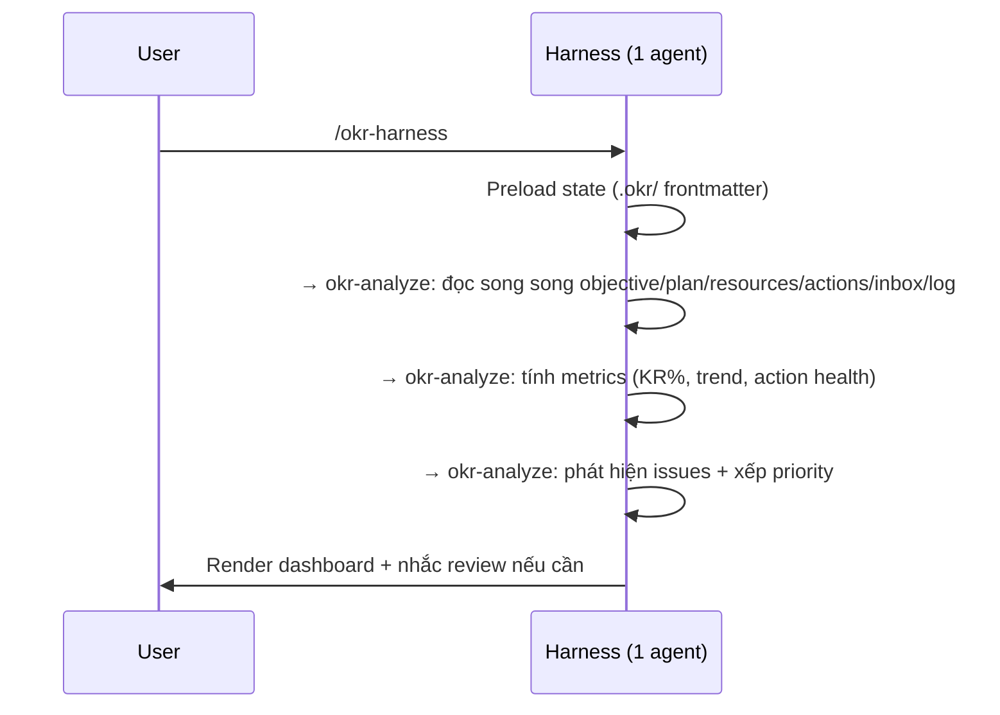
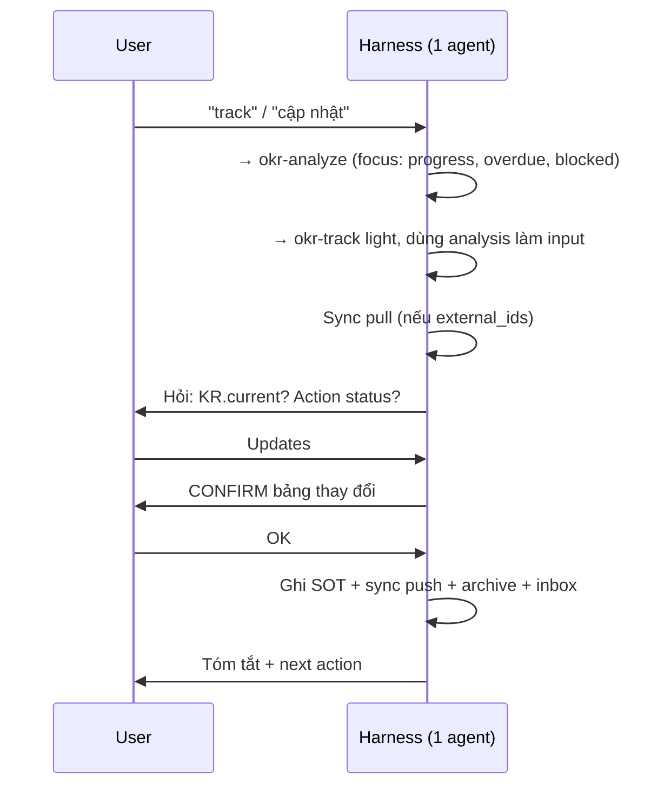
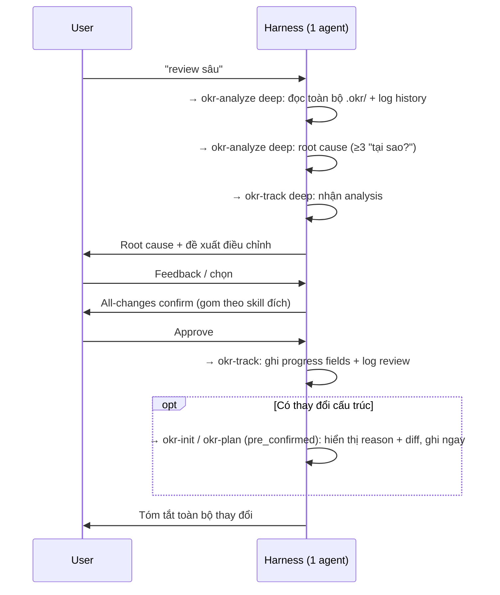
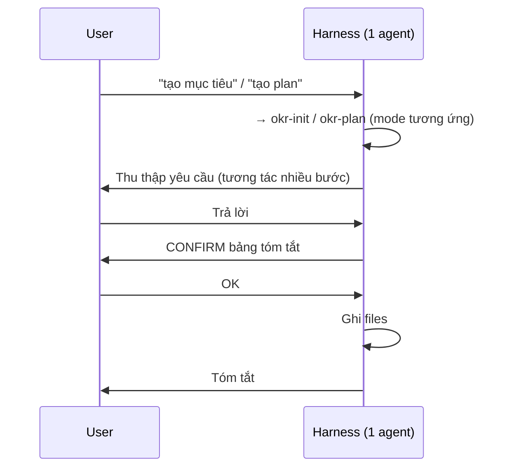
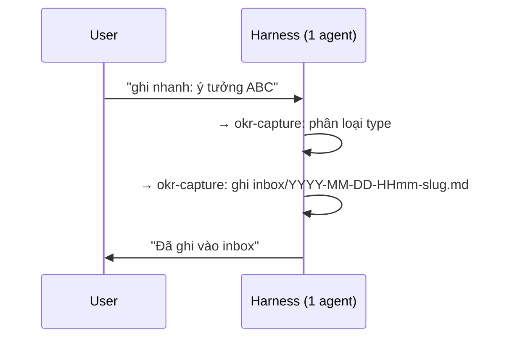
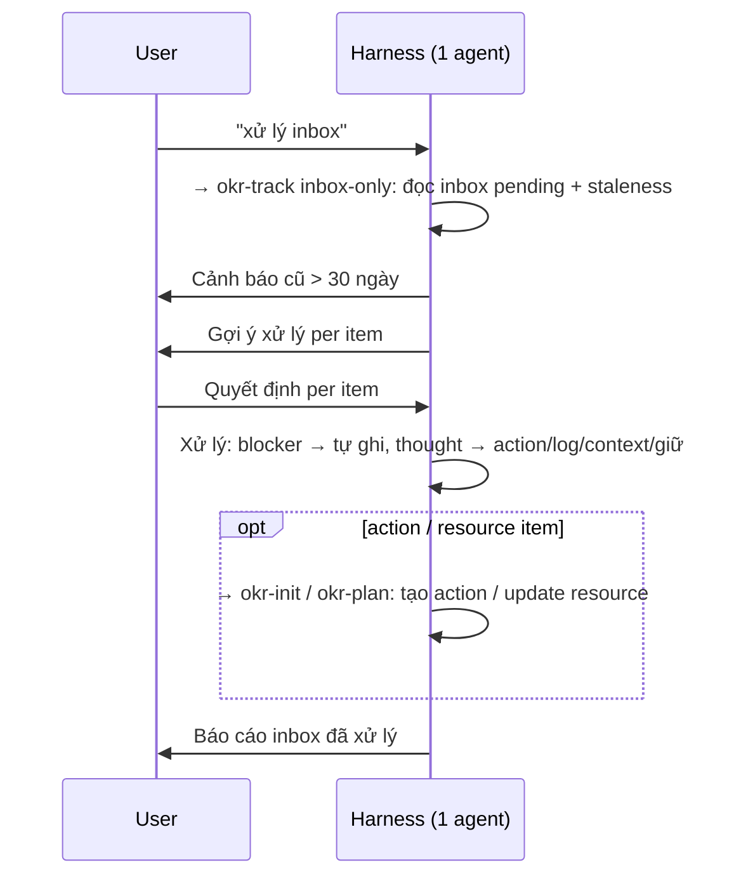
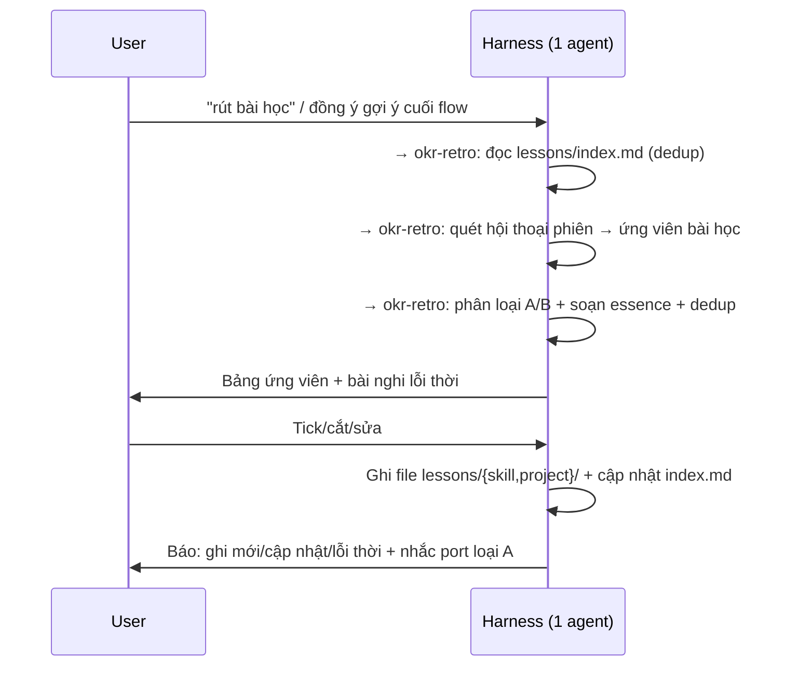

# Data Flows chi tiết (skill-only inline)

Toàn bộ luồng do **một agent** thực thi: orchestrator đọc state, rồi đọc tiếp SKILL.md phù hợp và chạy theo flow. "→ skill X" nghĩa là cùng agent đọc và thực thi skill X, không spawn sub-agent.

## 1. Dashboard flow

**okr-analyze output**: dashboard, metrics, issues, priority top 2, recommendations.

## 2. Track light flow

## 3. Deep review flow (chuỗi tuần tự inline, KHÔNG agent team)

**Thay đổi cấu trúc** (mỗi item, từ track deep sang init/plan):
- `apply_via`: "okr-init" / "okr-plan"
- `mode`: "update-objective" / "update" / "update-resource"
- `changes`: danh sách (field, from, to)
- `context.reason`: root cause text
- `pre_confirmed`: true (đã confirm tại all-changes preview)

> Trước đây bước này là agent team (analyst + tracker qua SendMessage, builder spawn riêng). Skill-only gộp thành chuỗi tuần tự một agent.

## 4. Init/Plan flow

## 5. Capture flow

## 6. Inbox flow

`thought` có 4 nhánh xử lý canonical ở `okr-track/references/flow-inbox.md`: tạo action, append log, nâng thành `context/<slug>.md` + `context/index.md`, hoặc giữ inbox.

## 7. Retro flow (rút bài học)

Record-only: `okr-retro` KHÔNG sửa file skill. Loại A là hàng đợi port thủ công về repo gốc. Chỉ user chủ động (hoặc đồng ý gợi ý cuối flow) mới chạy.
